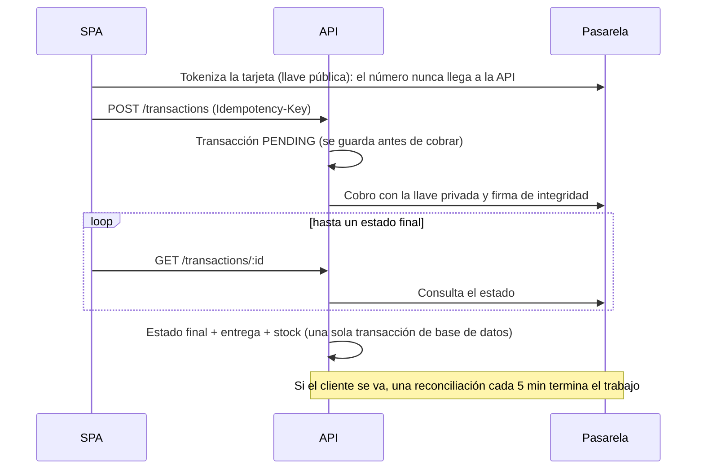
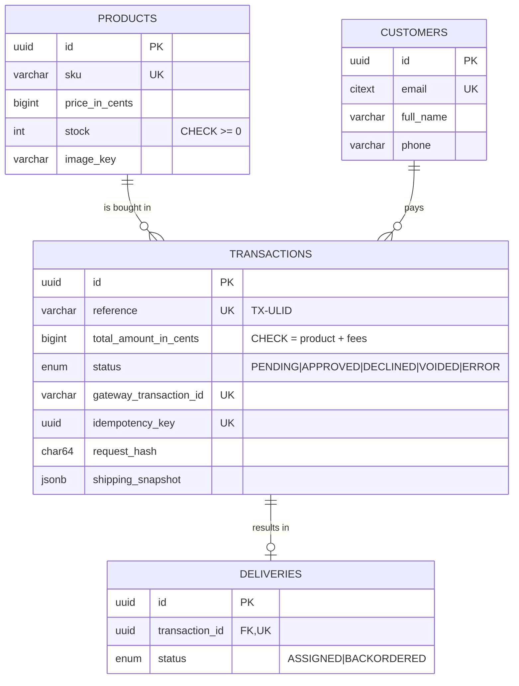

# Checkout Onboarding

App de checkout para un producto pagado con tarjeta de crédito a través de una **Payment Gateway (PG)** en modo *sandbox*, sin dinero real. El cliente ve el producto y su stock, ingresa la tarjeta y los datos de entrega, confirma el resumen y recibe el resultado del pago; al terminar, la API actualiza la transacción, asigna la entrega y descuenta el stock.

- **SPA:** React 19 + Redux Toolkit (Flux), *mobile-first*, sin framework de CSS → [`apps/web`](apps/web/README.md)
- **API:** NestJS 11 con arquitectura hexagonal y *Railway Oriented Programming*, PostgreSQL 16 → [`apps/api`](apps/api/README.md)
- **Cloud:** AWS con CDK (CloudFront, S3, API Gateway, Lambda, RDS, EventBridge Scheduler) y despliegue continuo con GitHub Actions + OIDC → [`infra`](infra/README.md)


## Links

| | |
|---|---|
| App desplegada | `AppUrl`, un output del stack web; se completa aquí tras el primer deploy ([cómo desplegar](infra/README.md#desplegar-desde-cero)) |
| Swagger (OpenAPI) | `<AppUrl>/api/docs`; en local, http://localhost:3000/api/docs |
| Colección de Postman | [`docs/postman/checkout-api.postman_collection.json`](docs/postman/checkout-api.postman_collection.json): pago aprobado y rechazado, idempotencia y errores |

## Flujo de negocio

```
1. Producto → 2. Tarjeta y entrega (modal) → 3. Resumen (Backdrop) → 4. Estado final → 5. Producto con el stock actualizado
```



## Cómo se cumple el enunciado

| Requisito | Dónde |
|---|---|
| Producto con descripción, precio y unidades en stock | `features/catalog` (SPA) · `GET /products`, `GET /products/:id/stock` |
| Botón "Pagar con tarjeta de crédito" que abre un modal | `CheckoutFlow`, `PaymentModal` |
| Tarjeta validada con estructura real (Luhn, vencimiento, CVC) y logos VISA/Mastercard | `features/checkout/domain`, `CardBrandLogo` |
| Datos de entrega | `DeliveryFields` · `POST /customers` · la dirección viaja con la transacción |
| Resumen con monto del producto, tarifa base y envío, y botón de pago en un Backdrop | `SummaryBackdrop` · `GET /checkout/quote` (el servidor calcula los montos) |
| Transacción PENDING, cobro en la pasarela y resultado | `CreateTransaction` → `SyncTransactionStatus` → `FinalizeTransaction` |
| Al terminar: actualizar la transacción, asignar la entrega y descontar el stock | `FinalizeTransaction` ([ADR-001](docs/adr/001-stock-decrement-on-approval.md), [ADR-003](docs/adr/003-payment-confirmation-strategy.md)) · `GET /deliveries/:id` |
| Mostrar el resultado y volver al producto con el stock actualizado | `TransactionStatusPage` (vuelve sola en 10 s o con un botón) |
| API con stock, transactions, customers y deliveries, con distintos tipos de request | [Endpoints](apps/api/README.md#endpoints) |
| La app recupera el progreso tras un refresh | Persistencia validada con TTL y recuperación por `Idempotency-Key` sin doble cobro ([ADR-006](docs/adr/006-idempotency-fingerprint.md)) |
| Datos sensibles manejados de forma segura | [`docs/security/README.md`](docs/security/README.md) |
| Redux siguiendo Flux; lógica fuera de los controllers; Hexagonal y ROP | [Arquitectura del front](apps/web/README.md#arquitectura) · [Arquitectura de la API](apps/api/README.md#arquitectura) |
| Base de datos sembrada con productos, sin endpoint para crearlos | Migraciones + seed idempotente |
| Tests con Jest > 80 % en front y back | [Pruebas y cobertura](#pruebas-y-cobertura) |
| Publicada en la nube | [`infra/README.md`](infra/README.md) |

## Modelo de datos



Los montos son enteros en centavos (COP). La base nunca guarda el número de tarjeta, el CVC ni el token.

## Cómo correrlo en local

Requisitos: Node 24 y Docker.

```bash
npm install                                        # instala los tres workspaces
docker compose up -d db                            # PostgreSQL 16 en localhost:5432
cp apps/api/.env.example apps/api/.env             # URL y llaves de la sandbox (no se versionan)
cp apps/web/.env.example apps/web/.env             # URL de la sandbox y llave pública
npm run db:migrate -w apps/api                     # migraciones + productos de prueba
npm run start:dev -w apps/api                      # API en http://localhost:3000 (Swagger en /api/docs)
npm run dev -w apps/web                            # SPA en http://localhost:5173
```

Tarjetas de prueba de la sandbox: `4242 4242 4242 4242` se aprueba y `4111 1111 1111 1111` se rechaza, con cualquier vencimiento futuro y un CVC de 3 dígitos.

## Pruebas y cobertura

```bash
npm test          # los tres workspaces, con cobertura (la API levanta PostgreSQL con Testcontainers)
npm run lint && npm run typecheck
```

| Workspace | Tests | Statements | Branches | Functions | Lines |
|---|---|---|---|---|---|
| API ([detalle](apps/api/README.md#pruebas-y-cobertura)) | 476 (337 unit, 39 integración, 100 e2e) | 99.08 % | 95.37 % | 98.66 % | 99.55 % |
| SPA ([detalle](apps/web/README.md#pruebas-y-cobertura)) | 326 | 97.37 % | 94.40 % | 98.37 % | 99.70 % |
| Infraestructura ([detalle](infra/README.md#pruebas)) | 52 | 100 % | 90.47 % | 100 % | 100 % |

El CI ([`ci.yml`](.github/workflows/ci.yml)) corre en cada PR y en cada push a `main`:

- lint, typecheck y `dependency-cruiser` (verifica las capas de la arquitectura hexagonal);
- los tests con un umbral de cobertura del 85 %;
- el build de la Lambda y el synth de CDK con `cdk-nag`;
- `npm audit`;
- una búsqueda de llaves y de palabras prohibidas en el repositorio.

## Documentación

| Documento | Contenido |
|---|---|
| [`docs/specs/`](docs/specs/00-overview.md) | Especificación (v1.2): visión general, backend, frontend y cloud, con la trazabilidad requisito → feature |
| [`docs/specs/CHANGELOG.md`](docs/specs/CHANGELOG.md) | Correcciones hechas a los specs y ajustes de alcance, cada uno con su motivo |
| [`docs/plans/`](docs/plans/) | Planes de implementación de backend, frontend y cloud |
| [`docs/adr/`](docs/adr/README.md) | Decisiones de arquitectura (ADR-001 a ADR-007) |
| [`docs/security/`](docs/security/README.md) | Datos sensibles, OWASP API Top 10, cabeceras e infraestructura |

## Estructura

```
apps/
  api/      NestJS: módulos products, checkout, customers, transactions, deliveries, payment-gateway
  web/      React: features catalog, checkout, transaction + UI kit propio
infra/      CDK: stacks network, database, api, web y el rol OIDC de GitHub
docs/       specs, planes, ADRs, seguridad, colección de Postman e imágenes
```

Cada feature se desarrolló en su propia rama y se integró a `main` con un merge `--no-ff`, con commits convencionales.
