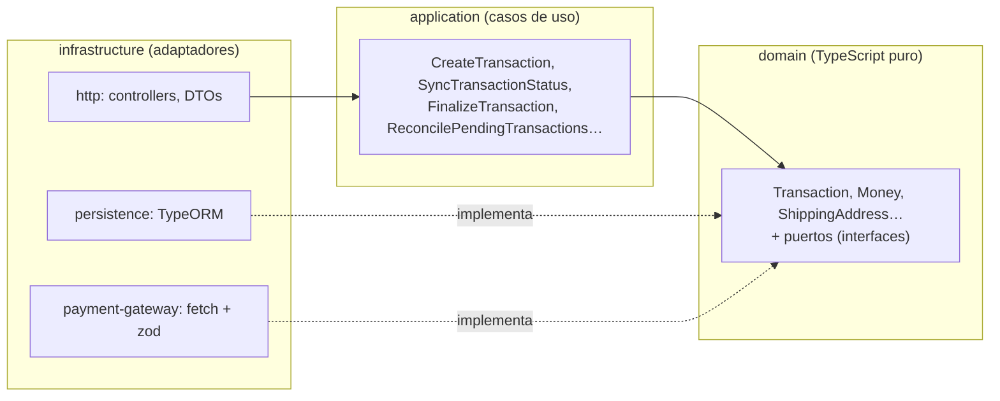
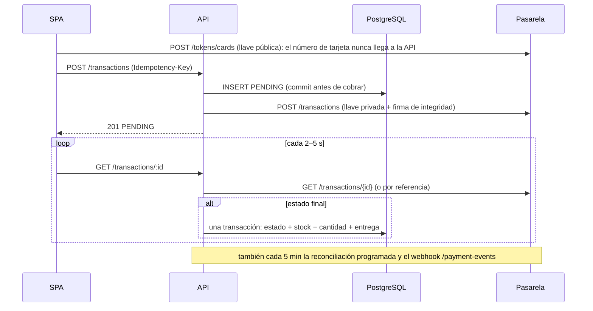
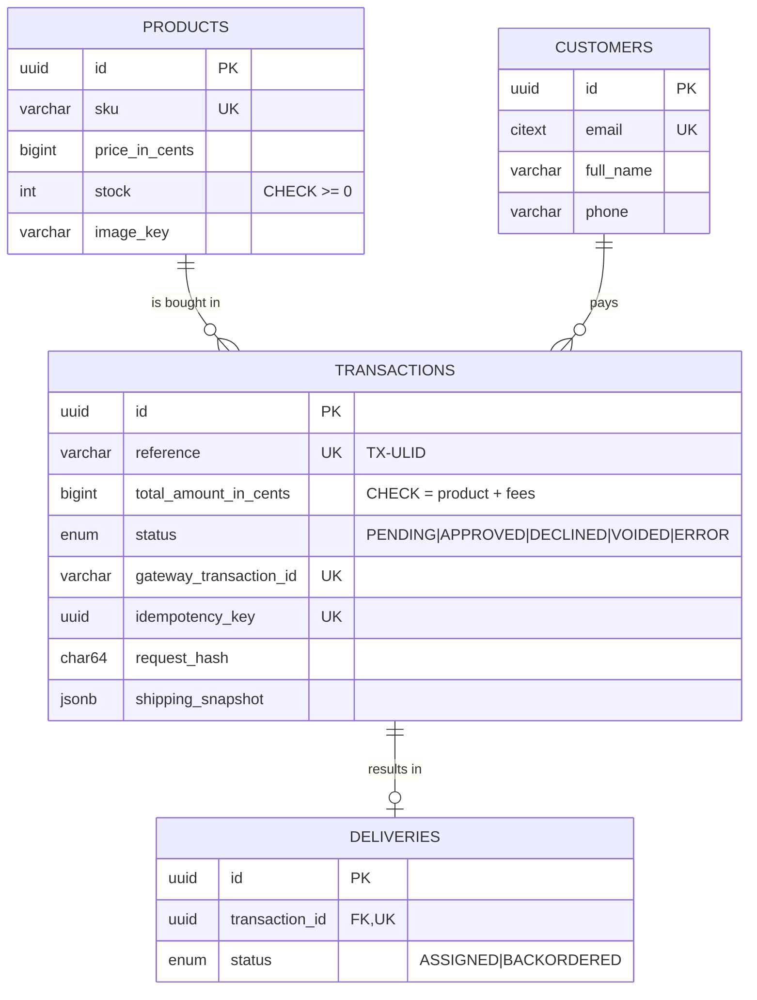

# Checkout API

API del checkout: catálogo con stock, precio del pedido, clientes invitados, pagos con tarjeta a través de la pasarela (sandbox, sin dinero real) y entregas. NestJS 11 + TypeScript estricto, arquitectura hexagonal y *Railway Oriented Programming*, PostgreSQL 16 y AWS Lambda.

- Documentación interactiva: `/api/docs` (OpenAPI en `/api/docs-json`).
- Colección de Postman: [`docs/postman/checkout-api.postman_collection.json`](../../docs/postman/checkout-api.postman_collection.json), con los flujos aprobado, rechazado, idempotencia y errores.
- Seguridad (OWASP API Top 10): [`docs/security/README.md`](../../docs/security/README.md).

## Arquitectura

Cada módulo (`products`, `checkout`, `customers`, `transactions`, `deliveries`, `payment-gateway`) tiene tres capas, y las dependencias solo apuntan hacia adentro. `dependency-cruiser` lo verifica en CI.



- **Ports & Adapters:** los casos de uso dependen de puertos (`TransactionRepository`, `PaymentGateway`, `UnitOfWork`, `Clock`, `AlertLog`…) registrados con *tokens* `Symbol`. La capa de aplicación no importa nada de Nest: cada módulo arma sus casos de uso con *factory providers*.
- **ROP:** los casos de uso devuelven `Result<T, DomainError>` y encadenan pasos con `AsyncResult` (`andThen`, `map`). El primer error desvía el flujo y los pasos siguientes no se ejecutan. `throw` queda solo para lo inesperado (bug, caída de la base). Un único mapper traduce `DomainError` a HTTP como `application/problem+json` (RFC 9457).
- **Agregado con máquina de estados:** `Transaction` pasa de `PENDING` a `APPROVED | DECLINED | VOIDED | ERROR`, y un estado final nunca cambia.

## Flujo de pago



Garantías del cobro:

- **Nunca dos cobros.** El `Idempotency-Key` se combina con un *fingerprint* del pedido que excluye las credenciales de un solo uso (ADR-006). La misma key con el mismo pedido responde 200 como *replay*; con otro pedido, 422. Dos requests simultáneas con la misma key terminan en una sola fila por el `UNIQUE`, y hay un test de carrera real contra Postgres que lo verifica.
- **Nunca un stock negativo.** El decremento es un `UPDATE … WHERE stock >= cantidad`. Si otra compra se llevó las unidades, la entrega queda `BACKORDERED` y el caso queda registrado en el log.
- **Se finaliza una sola vez.** La guardia optimista `UPDATE … WHERE status = 'PENDING'` hace que el polling, el webhook y la reconciliación puedan correr a la vez. Con dos finalizaciones concurrentes hay un solo decremento y una sola entrega (test de integración).
- **El cargo es exactamente el nuestro.** Si la pasarela reporta otra referencia, monto o moneda, la transacción queda `ERROR AMOUNT_MISMATCH` sin tocar el stock (I-06).
- **Ninguna PENDING queda huérfana.** Una Lambda programada cada 5 minutos las sincroniza y, pasados 15 minutos sin registro en la pasarela, las marca como `ERROR EXPIRED_WITHOUT_GATEWAY_RECORD` (C-03, ADR-007).

## Modelo de datos



Los montos son enteros en centavos. Las columnas `bigint` pasan por un *transformer* que las convierte a `number` seguro (C-05). La base nunca guarda el número de tarjeta, el CVC ni el token.

## Endpoints

| Método | Ruta | Respuestas |
|---|---|---|
| GET | `/api/v1/health` | 200, 503 |
| GET | `/api/v1/products` · `/products/:id` · `/products/:id/stock` | 200, 400, 404 |
| GET | `/api/v1/checkout/quote?productId&quantity` | 200, 400, 404, 409 |
| GET | `/api/v1/checkout/acceptance` | 200, 502, 503 |
| POST | `/api/v1/customers` | 201 (nuevo), 200 (email existente), 400 |
| GET | `/api/v1/customers/:id` | 200 (enmascarado), 404 |
| POST | `/api/v1/transactions` + `Idempotency-Key` | 201, 200 (*replay*), 400, 404, 409, 422, 429 |
| GET | `/api/v1/transactions/:id` | 200 (sincroniza si está PENDING), 404 |
| GET | `/api/v1/transactions?idempotencyKey=` | 200, 404 |
| GET | `/api/v1/deliveries/:id` | 200, 404 |
| POST | `/api/v1/payment-events` | 200, 400, 401 |

## Cómo correrla

Requisitos: Node 24 y Docker.

```bash
npm install                                   # desde la raíz del monorepo
docker compose up -d db                       # PostgreSQL 16 en localhost:5432
cp apps/api/.env.example apps/api/.env        # completar PG_* con la URL y las llaves de sandbox
npm run db:migrate -w apps/api                # migraciones + seed de productos
npm run start:dev -w apps/api                 # http://localhost:3000/api/docs
```

`npm run pg:smoke -w apps/api` es una prueba manual contra la sandbox real: tokeniza una tarjeta de prueba, crea la transacción, la consulta por id y por referencia, e imprime las respuestas con las llaves redactadas. Nunca corre en CI.

Tarjetas de prueba de la sandbox: `4242 4242 4242 4242` → aprobada, `4111 1111 1111 1111` → rechazada (vencimiento futuro, CVC de 3 dígitos).

## Pruebas y cobertura

```bash
npm test -w apps/api                 # todo, con cobertura (Postgres por Testcontainers)
npm run test:unit -w apps/api        # sin Docker
npm run lint -w apps/api && npm run typecheck -w apps/api && npm run depcruise -w apps/api
```

| Proyecto | Qué prueba | Tests |
|---|---|---|
| unit | Dominio, casos de uso con *fakes*, adaptadores con `fetch` simulado | 335 |
| integration | Repositorios, migraciones, unidad de trabajo, carreras reales y handlers de Lambda contra PostgreSQL | 41 |
| e2e | La app completa por HTTP (supertest) con la pasarela simulada | 100 |

Cobertura de la corrida completa (umbral de CI: 85 %):

| Statements | Branches | Functions | Lines |
|---|---|---|---|
| 99.08 % | 95.31 % | 98.65 % | 99.55 % |

## Lambda

`npm run build:lambda -w apps/api` compila con `tsc` (que emite la metadata de decoradores que Nest necesita) y luego empaqueta el JavaScript con esbuild en `dist-lambda/` (C-01, ADR-005):

- `lambda.js`: la API HTTP detrás de API Gateway.
- `migrate.js`: migraciones y seed; lo invoca el pipeline después del deploy, porque RDS es privada.
- `reconcile.js`: la reconciliación que dispara EventBridge Scheduler cada 5 minutos.

`npm run smoke:lambda -w apps/api` carga los tres *bundles* y falla si esbuild rompió algo. Los secretos se leen de SSM y de Secrets Manager al iniciar cada contenedor.
