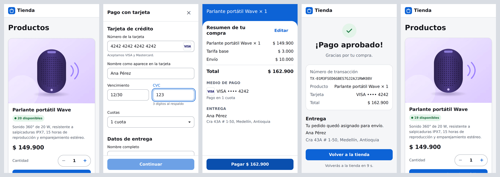
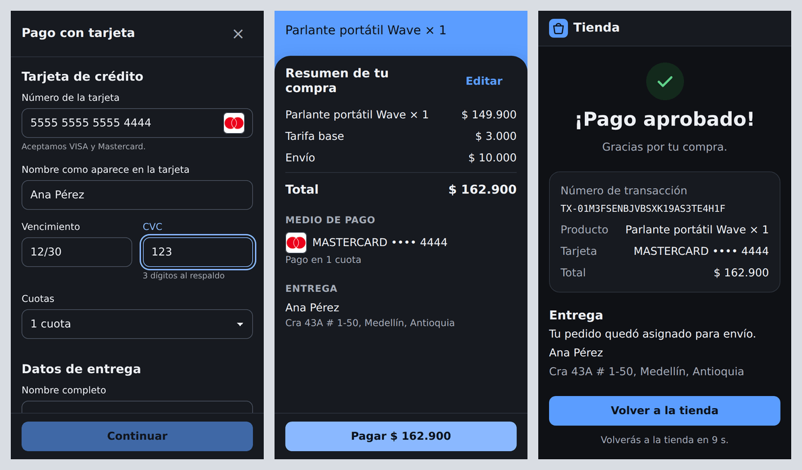
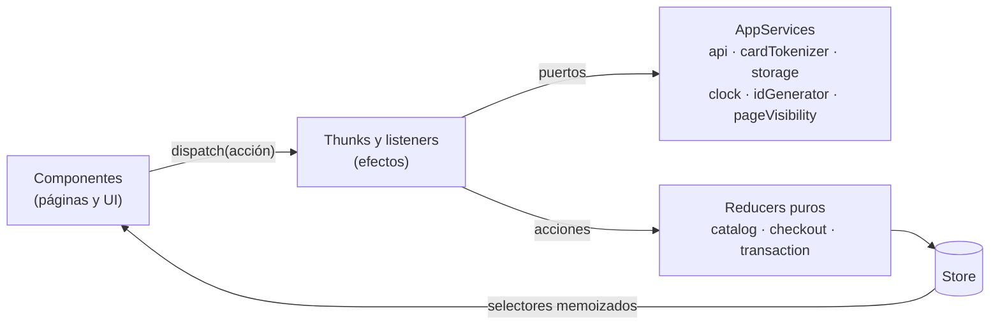

# Checkout SPA

SPA del checkout: muestra el producto con su stock, pide la tarjeta y los datos de entrega en un modal, presenta el resumen en un *Backdrop*, confirma el pago y vuelve al producto con el stock actualizado. React 19 + TypeScript estricto, Redux Toolkit siguiendo Flux, diseño *mobile-first* sin framework de CSS.



*Pasos 1 → 5 a 375 × 667: producto, tarjeta con detección de marca, resumen en Backdrop, estado final y producto con el stock actualizado (20 → 19).*



*El mismo flujo con `prefers-color-scheme: dark` y una Mastercard.*

## Cómo correrla

Requisitos: Node 24 y la API corriendo en `localhost:3000` (ver [`apps/api/README.md`](../api/README.md)).

```bash
npm install                                   # desde la raíz del monorepo
cp apps/web/.env.example apps/web/.env        # completar la URL y la llave pública de la sandbox
npm run dev -w apps/web                       # http://localhost:5173 (Vite reenvía /api a la API)
```

| Variable | Uso |
|---|---|
| `VITE_API_BASE_URL` | Base de la API. `/api` en local y en AWS: mismo origen, sin CORS |
| `VITE_PG_BASE_URL` | URL *sandbox* de la pasarela, usada solo para tokenizar la tarjeta |
| `VITE_PG_PUBLIC_KEY` | Llave pública de la pasarela (pública por diseño) |

`shared/config/env.ts` es el único módulo que lee `import.meta.env` y valida las variables con zod al arrancar.

**Tarjetas de prueba de la sandbox:** `4242 4242 4242 4242` se aprueba y `4111 1111 1111 1111` se rechaza, con cualquier vencimiento futuro y un CVC de 3 dígitos. Para ver la detección de Mastercard sirve `5555 5555 5555 4444`.

## Arquitectura



- **Flux con Redux Toolkit.** Los reducers son funciones puras. Los efectos viven en *thunks* (`fetchProducts`, `submitPaymentForm`, `payOrder`…) y en el *listener middleware*: el polling del estado del pago y la persistencia. Los componentes solo despachan acciones y leen con selectores.
- **Ports & Adapters en el front.** Los thunks reciben sus dependencias por `thunk.extraArgument` (`AppServices`): el cliente HTTP, el tokenizador, el storage, el reloj, el generador de ids y la visibilidad de la página. En los tests se reemplazan por *fakes*, sin mocks de módulos.
- **Result en los servicios.** El cliente HTTP devuelve `Result<T, ApiError>`: parsea `application/problem+json` y valida cada respuesta con zod, así que un error de red, un timeout o una respuesta inesperada llegan a la UI como un código conocido.
- **Por feature:** `features/catalog` (pasos 1 y 5), `features/checkout` (pasos 2 y 3), `features/transaction` (paso 4). `shared/` tiene el UI kit accesible (Modal, Backdrop, TextField…), el cliente HTTP, i18n y los hooks.

### Recuperación tras un refresh

El estado se guarda en `localStorage` (`checkout-app:v1`) con debounce, versión y un TTL de 30 minutos. Al arrancar se valida con zod; si algo no cuadra, la app arranca limpia.

| Si se refresca en… | Qué pasa |
|---|---|
| El formulario | Reabre el modal con la entrega precargada; la tarjeta se escribe de nuevo |
| El resumen | Vuelve al formulario con el aviso "vuelve a ingresar los datos de tu tarjeta" (el token no se guarda) |
| El pago en curso, con id de transacción | Retoma el polling |
| El pago en curso, antes de recibir el id | Busca la transacción por `Idempotency-Key`. Si no existe, pide la tarjeta de nuevo con **la misma key**, así el backend nunca cobra dos veces (ADR-006) |
| El estado final o un link directo a `/transactions/:id` | Carga la transacción desde la API |

## Seguridad

- **El número de tarjeta y el CVC nunca entran al store ni al storage.** `submitPaymentForm` los recibe del formulario y los envía directo a la pasarela con la llave pública. Al estado solo llegan la marca, los últimos 4 dígitos y el token, y el token no se persiste. Un test del flujo completo revisa cada escritura al storage.
- Los borradores de entrega sí se persisten, porque son necesarios para recuperar el progreso, pero expiran a los 30 minutos y se borran al terminar.
- Los links a los términos de la pasarela abren con `rel="noopener noreferrer"`.
- CSP, HSTS y los demás headers los pone CloudFront ([`docs/security/README.md`](../../docs/security/README.md)).

## Responsive, CSS y navegadores

- *Mobile-first* con grid y flexbox, tipografía fluida con `clamp()` y *design tokens* en custom properties, con modo oscuro por `prefers-color-scheme` y `prefers-reduced-motion`.
- El modal es un *bottom sheet* en móvil con el botón fijo abajo. El resumen es un **Backdrop** de Material (capa trasera con el producto y capa delantera con el detalle).
- `ProductCard` se adapta con *container queries*. Departamento y ciudad van lado a lado solo si caben sin cortar el texto (`auto-fit` + `minmax`). `:has()` resalta la etiqueta del campo enfocado como mejora progresiva.

Verificado con Playwright (Chromium) en 320 × 568, 375 × 667 (también en modo oscuro), 390 × 844, 768 × 1024, 1024 × 768 y 1440 × 900, en cada pantalla del flujo:

- sin scroll horizontal;
- ningún elemento fuera del viewport;
- ningún texto ni valor de select cortado;
- el botón principal del modal y del resumen siempre visible.

El build apunta a Chrome/Edge 107+, Firefox 104+ y Safari/iOS 15+ (`vite.config.ts`), y autoprefixer usa el `browserslist` del `package.json`. Firefox, Safari y Edge se revisan a mano sobre la URL desplegada.

## Rendimiento

| Chunk | Tamaño (gzip) | Cuándo se descarga |
|---|---|---|
| `framework` (React, React Router) | 101 kB | Al inicio; cambia poco y queda en caché entre deploys |
| `index` (app, Redux, zod) | 51 kB | Al inicio |
| `PaymentFlow` (formularios, reglas de tarjeta) | 21 kB | En segundo plano cuando el navegador está libre, o al abrir el modal |
| `TransactionStatusPage` | 2 kB | Igual que el anterior |

- Las imágenes van en AVIF, WebP y JPG a 320, 640 y 960 px con `srcset`/`sizes` y dimensiones explícitas (sin CLS). La primera se pide con `fetchpriority="high"` y el resto con `loading="lazy"`.
- La variante de 640 px más pesada ocupa 14.7 KB; `npm run images` falla si alguna supera 80 KB.

Lighthouse 12 en perfil móvil (throttling simulado), contra el build de producción servido con `vite preview` y la API local:

| Performance | Accessibility | Best Practices | LCP | CLS | TBT |
|---|---|---|---|---|---|
| 96 | 100 | 100 | 2.5 s | 0 | 70 ms |

`vite preview` no comprime las respuestas; CloudFront sí, así que en AWS el LCP baja. Para medir sobre el deploy: Chrome DevTools → Lighthouse → *Mobile*.

## Pruebas y cobertura

```bash
npm test -w apps/web            # Jest con cobertura (umbral de CI: 85 %)
npm run lint -w apps/web && npm run stylelint -w apps/web && npm run typecheck -w apps/web
```

| Nivel | Qué prueba |
|---|---|
| Funciones puras | Luhn, marca, vencimiento, formato de montos, esquema de persistencia (tests de tabla) |
| Reducers y selectores | Transiciones de paso, recuperación, reset |
| Thunks y listeners | Cada rama de error de la cadena de pago, el polling con *fake timers*, la persistencia |
| Componentes | Interacción real con Testing Library y `user-event`, consultas por rol y etiqueta |
| Flujo completo | [`test/integration/checkout-flow.test.tsx`](test/integration/checkout-flow.test.tsx): pasos 1 → 5 aprobado y rechazado con el store real y solo la API y el tokenizador falsos |

**326 tests en 45 suites.** Cobertura:

| Statements | Branches | Functions | Lines |
|---|---|---|---|
| 97.37 % | 94.40 % | 98.37 % | 99.70 % |
