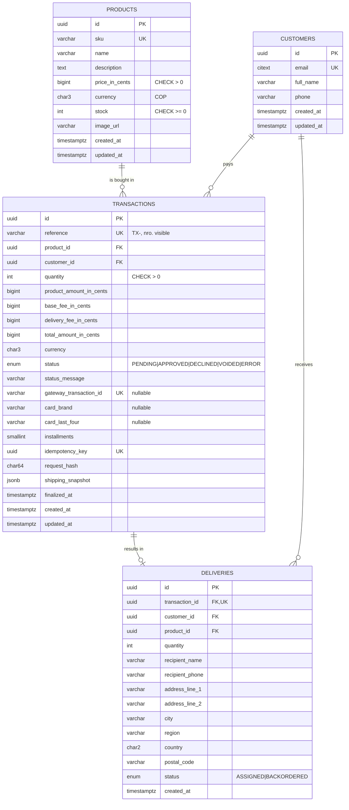
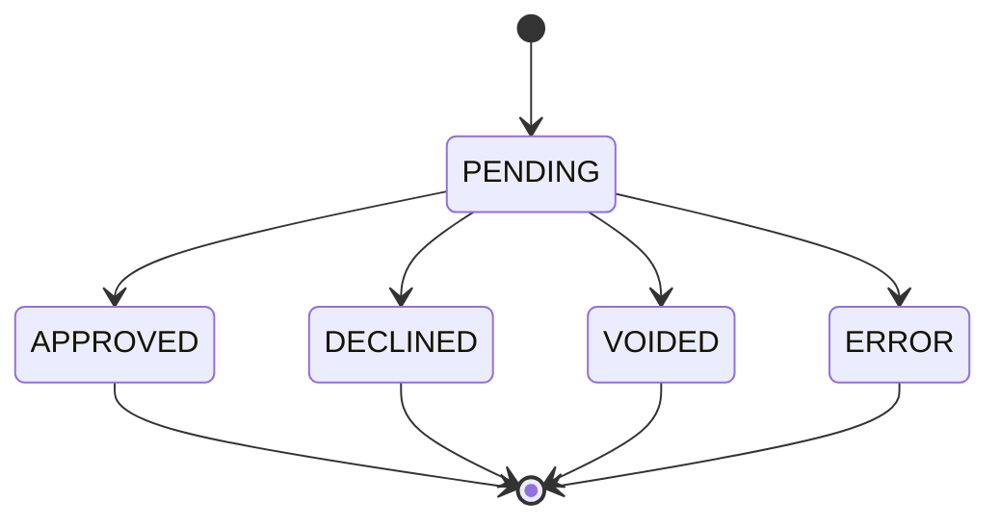
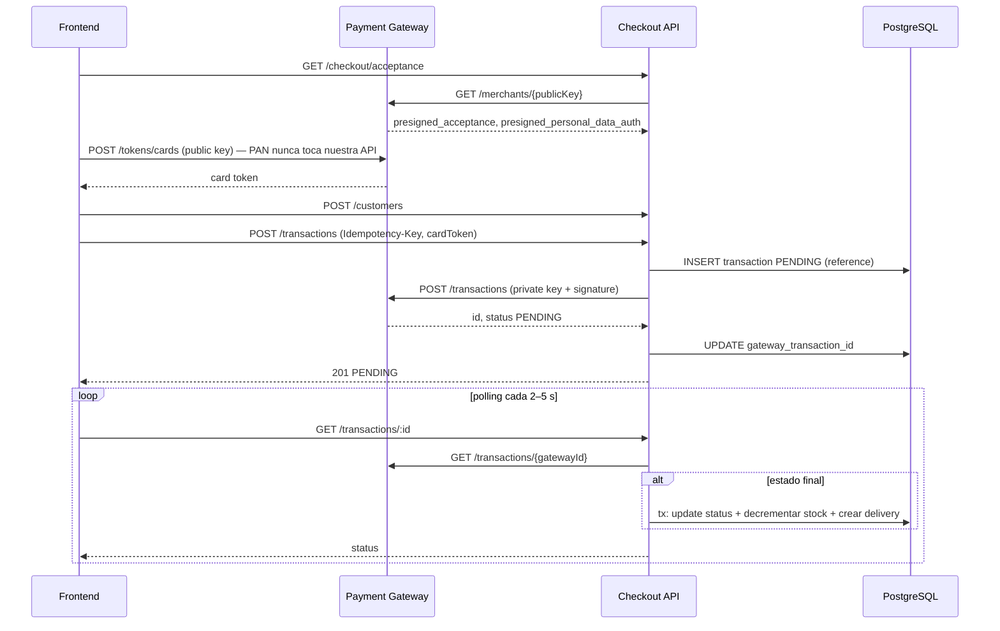

# Spec Backend — Checkout API

> **Regla de nombres:** este repositorio es público y **no puede contener el nombre de la compañía evaluadora**. En código, variables, commits y docs se usa siempre el término neutro **Payment Gateway (PG)** / "pasarela". Las URLs y llaves reales viven solo en variables de entorno / SSM, nunca en el repo.

---

## 0. Contexto y alcance

API REST que soporta el onboarding de compra de un producto pagado con tarjeta de crédito a través de la pasarela (sandbox):

1. Exponer productos con su stock (seeded, sin endpoint de creación).
2. Registrar clientes y datos de entrega.
3. Crear una transacción **PENDING** propia, obtener su número/referencia y cobrar a través de la pasarela.
4. Al llegar a un estado final (APPROVED / DECLINED / VOIDED / ERROR): actualizar la transacción, **asignar la entrega** al cliente y **descontar stock**.

Recursos obligatorios según la prueba: **stock (products), transactions, customers, deliveries**, con distintos tipos de request (GET/POST).

Fuera de alcance: autenticación de usuarios finales, anulaciones/reembolsos, CRUD de productos.

---

## 1. Stack y librerías

| Tema | Elección | Motivo |
|---|---|---|
| Runtime | Node.js 22 LTS (Lambda `nodejs22.x`, arm64) | LTS soportada por Lambda |
| Lenguaje | TypeScript `strict: true`, `noUncheckedIndexedAccess`, `exactOptionalPropertyTypes` | Tipado fuerte = menos bugs en montos/estados |
| Framework | **NestJS 11** | Permitido por la prueba; DI nativa para puertos/adaptadores |
| DB | **PostgreSQL 16** (RDS) | Transacciones ACID para stock + estado de pago |
| ORM | **TypeORM** + migraciones explícitas (`synchronize: false`) | Integración Nest, `QueryRunner` para unidad de trabajo |
| Validación de entrada | `class-validator` + `class-transformer` (DTOs en capa HTTP) | Estándar Nest; `whitelist` + `forbidNonWhitelisted` |
| Validación de config | `zod` | Fail-fast al arrancar si falta una variable |
| ROP | `Result<T,E>` / `AsyncResult<T,E>` propios en `shared/kernel` (alternativa aceptable: `neverthrow`) | Bonus ROP; errores tipados sin `throw` |
| HTTP saliente | `fetch` nativo + `AbortController` (timeouts) | Sin dependencias extra |
| Logs | `nestjs-pino` con `redact` | JSON estructurado, sin PII/datos de tarjeta |
| Seguridad | `helmet`, `@nestjs/throttler`, CORS allowlist | OWASP / bonus headers |
| Docs API | `@nestjs/swagger` (OpenAPI 3) + colección Postman exportada | Requisito README |
| Lambda | `@codegenie/serverless-express` (handler que reutiliza la app Nest cacheada) | Mismo `AppModule` local y en Lambda |
| IDs | UUID v4 (entidades), ULID para referencia de pago | No enumerables; referencia ordenable |
| Tests | **Jest** + `ts-jest`, `supertest`, `@testcontainers/postgresql` | Requisito Jest; integración real contra Postgres |
| Calidad | ESLint (typescript-eslint strict), Prettier, `dependency-cruiser`, Husky + lint-staged + commitlint | Clean code verificable en CI |

---

## 2. Principios de arquitectura

### 2.1 Hexagonal (Ports & Adapters)

```
          ┌─────────────── infrastructure (adapters) ───────────────┐
          │  HTTP controllers/DTOs   TypeORM repos   PG HTTP client │
          │            │                  ▲                ▲        │
          │            ▼                  │                │        │
          │   ┌──────── application (use cases) ────────┐  │        │
          │   │   depende SOLO de puertos (interfaces)  │──┘        │
          │   │   ┌──────────── domain ─────────────┐   │           │
          │   │   │ entidades, value objects, reglas│   │           │
          │   │   │ puertos, errores de dominio     │   │           │
          │   │   └─────────────────────────────────┘   │           │
          │   └─────────────────────────────────────────┘           │
          └─────────────────────────────────────────────────────────┘
```

Reglas (verificadas con `dependency-cruiser` en CI):

- `domain/` **no importa** nada de Nest, TypeORM, `fetch` ni de otras capas.
- `application/` importa solo `domain/` y `shared/kernel`. Nada de decoradores de Nest excepto `@Injectable()` e `@Inject(TOKEN)` (aceptado como pegamento de DI).
- `infrastructure/` implementa puertos y es la única capa que conoce frameworks.
- Controllers **no contienen lógica de negocio**: validan DTO → llaman al caso de uso → mapean `Result` a HTTP.
- Los puertos se inyectan por **tokens** (`export const PRODUCT_REPOSITORY = Symbol('ProductRepository')`).

### 2.2 Railway Oriented Programming

Cada caso de uso devuelve `Promise<Result<Output, DomainError>>`. Los pasos se encadenan con `andThen` / `map` / `mapErr` / `tap`; el primer error "desvía el tren" y los siguientes pasos no se ejecutan. `throw` queda reservado para errores **inesperados** (bugs, caída de DB), capturados por el filtro global → 500.

```ts
// shared/kernel/result.ts (resumen de la API esperada)
export type Result<T, E> = Ok<T> | Err<E>;
export const ok = <T>(value: T): Ok<T> => ({ ok: true, value });
export const err = <E>(error: E): Err<E> => ({ ok: false, error });

export class AsyncResult<T, E> implements PromiseLike<Result<T, E>> {
  static from<T, E>(r: Result<T, E> | Promise<Result<T, E>>): AsyncResult<T, E>;
  map<U>(fn: (v: T) => U | Promise<U>): AsyncResult<U, E>;
  andThen<U, F>(fn: (v: T) => Result<U, F> | Promise<Result<U, F>> | AsyncResult<U, F>): AsyncResult<U, E | F>;
  mapErr<F>(fn: (e: E) => F): AsyncResult<T, F>;
  tap(fn: (v: T) => void | Promise<void>): AsyncResult<T, E>;
  match<R>(onOk: (v: T) => R, onErr: (e: E) => R): Promise<R>;
}
```

Ejemplo de caso de uso (forma objetivo):

```ts
execute(cmd: CreateTransactionCommand): Promise<Result<TransactionView, CreateTransactionError>> {
  return AsyncResult.from(this.idempotency.check(cmd))
    .andThen((c) => this.loadProduct(c))
    .andThen(ensureStockAvailable)
    .map((c) => priceOrder(c, this.feePolicy))
    .andThen((c) => this.loadCustomer(c))
    .andThen((c) => this.persistPending(c))
    .andThen((c) => this.chargeThroughGateway(c))
    .map(toTransactionView);
}
```

### 2.3 Errores de dominio

Unión discriminada, nunca strings sueltos:

```ts
export type DomainError =
  | { code: 'VALIDATION_ERROR'; details: FieldError[] }
  | { code: 'PRODUCT_NOT_FOUND'; productId: string }
  | { code: 'CUSTOMER_NOT_FOUND'; customerId: string }
  | { code: 'TRANSACTION_NOT_FOUND'; transactionId: string }
  | { code: 'DELIVERY_NOT_FOUND'; deliveryId: string }
  | { code: 'INSUFFICIENT_STOCK'; available: number; requested: number }
  | { code: 'IDEMPOTENCY_CONFLICT' }
  | { code: 'INVALID_STATE_TRANSITION'; from: TransactionStatus; to: TransactionStatus }
  | { code: 'INVALID_EVENT_SIGNATURE' }
  | { code: 'GATEWAY_UNAVAILABLE' }
  | { code: 'GATEWAY_REJECTED'; reason: string };
```

Un único `domain-error.http-mapper.ts` traduce a HTTP + `application/problem+json` (RFC 7807):

| code | HTTP |
|---|---|
| VALIDATION_ERROR | 400 |
| PRODUCT/CUSTOMER/TRANSACTION/DELIVERY_NOT_FOUND | 404 |
| INSUFFICIENT_STOCK, INVALID_STATE_TRANSITION | 409 |
| IDEMPOTENCY_CONFLICT | 422 |
| INVALID_EVENT_SIGNATURE | 401 |
| GATEWAY_UNAVAILABLE | 503 |
| (no mapeado / excepción) | 500 sin stack ni detalles internos |

### 2.4 Clean code — reglas concretas

- Funciones ≤ ~20 líneas, un nivel de abstracción; casos de uso con un solo método público `execute`.
- Montos **siempre en enteros de centavos** (`amountInCents: number` validado como entero seguro) mediante el value object `Money`; nunca `float`.
- Sin "magic numbers": fees, timeouts, TTLs en config tipada.
- Nombres de dominio en inglés (`Transaction`, `Delivery`), mensajes de UI en español solo en el frontend.
- Mappers explícitos `ORM entity ⇄ domain entity ⇄ DTO`; las entidades ORM nunca salen de `infrastructure/`.
- Nada de `any`; `unknown` + type guards en fronteras (respuestas de la pasarela).

---

## 3. Estructura de carpetas

```
apps/api/
├── src/
│   ├── main.ts                      # bootstrap HTTP local
│   ├── lambda.ts                    # handler Lambda (reutiliza AppModule)
│   ├── app.module.ts
│   ├── shared/
│   │   ├── kernel/                  # result.ts, async-result.ts, domain-error.ts, money.ts, clock.port.ts, id-generator.port.ts
│   │   └── infrastructure/
│   │       ├── config/              # env.schema.ts (zod), app-config.service.ts
│   │       ├── database/            # data-source.ts, typeorm-unit-of-work.ts, migrations/, seeds/
│   │       ├── http/                # problem-details.filter.ts, domain-error.http-mapper.ts, request-id.middleware.ts
│   │       └── logging/             # pino config con redact
│   └── modules/
│       ├── products/
│       │   ├── domain/              # product.ts, product.repository.port.ts
│       │   ├── application/         # list-products.use-case.ts, get-product.use-case.ts
│       │   └── infrastructure/
│       │       ├── persistence/     # product.orm-entity.ts, typeorm-product.repository.ts, product.mapper.ts
│       │       └── http/            # products.controller.ts, dto/
│       ├── checkout/                # pricing: fee-policy.port.ts, flat-fee.policy.ts, get-quote.use-case.ts, acceptance
│       ├── customers/
│       ├── transactions/
│       │   ├── domain/              # transaction.ts (state machine), transaction-status.ts, payment-gateway.port.ts, ...
│       │   ├── application/         # create-transaction, sync-transaction-status, finalize-transaction, handle-payment-event, find-by-idempotency-key
│       │   └── infrastructure/
│       │       ├── gateway/         # http-payment-gateway.adapter.ts, integrity-signature.ts, event-checksum.ts, gateway.mapper.ts
│       │       ├── persistence/
│       │       └── http/            # transactions.controller.ts, payment-events.controller.ts
│       └── deliveries/
├── test/
│   ├── fakes/                       # in-memory repos, FakePaymentGateway, FixedClock
│   ├── integration/                 # repos contra Postgres (Testcontainers)
│   └── e2e/                         # supertest sobre la app completa
├── jest.config.ts
└── .dependency-cruiser.cjs
```

---

## 4. Modelo de dominio y datos

### 4.1 Diagrama ER (incluir en README)



Índices: `transactions(status, created_at)`, `transactions(customer_id)`, únicos indicados arriba. `CHECK (total_amount_in_cents = product_amount_in_cents + base_fee_in_cents + delivery_fee_in_cents)`.

**Nunca** se persisten PAN, CVC, fecha de expiración ni el token de tarjeta. Solo `card_brand` y `card_last_four` provenientes de la respuesta de la pasarela.

### 4.2 Máquina de estados de `Transaction`



- Los estados finales son inmutables: `transaction.finalize(status)` devuelve `err(INVALID_STATE_TRANSITION)` si ya no está en PENDING.
- La transición se persiste con **guardia optimista**: `UPDATE transactions SET ... WHERE id = $1 AND status = 'PENDING'`. Si afecta 0 filas → ya fue finalizada por otro proceso (polling vs webhook) → operación idempotente sin efectos secundarios.

### 4.3 Regla de stock (decisión documentada como ADR-001)

- Al **crear** la transacción: se verifica `stock >= quantity` (falla rápido con 409).
- Al **finalizar APPROVED**, dentro de una única transacción de DB:
  1. `UPDATE transactions ... WHERE status='PENDING'`
  2. `UPDATE products SET stock = stock - $q WHERE id = $p AND stock >= $q` (decremento atómico, nunca negativo)
  3. `INSERT INTO deliveries` con status `ASSIGNED` (o `BACKORDERED` si el paso 2 afectó 0 filas por una carrera; se loguea `warn` para gestión manual).
- DECLINED/VOIDED/ERROR: solo se actualiza la transacción; el stock no cambia.
- Por qué no reservar stock al crear: la cuenta sandbox es compartida y no se puede configurar el webhook de forma fiable; una transacción abandonada retendría stock indefinidamente sin un job de expiración. Se deja la reserva como mejora futura en el ADR.

### 4.4 Pricing

`total = price × quantity + BASE_FEE + DELIVERY_FEE` en centavos. Fees vienen de config (`BASE_FEE_IN_CENTS`, `DELIVERY_FEE_IN_CENTS`) a través del puerto `FeePolicy` (Strategy) para poder variar el costo de envío por ciudad sin tocar casos de uso. **El backend siempre recalcula**; el frontend nunca envía montos.

---

## 5. Contrato de API

Prefijo global: `/api`, versionado por URI: `/api/v1/...`. JSON `camelCase`. Errores `application/problem+json`:

```json
{
  "type": "https://errors.checkout.local/insufficient-stock",
  "title": "Insufficient stock",
  "status": 409,
  "code": "INSUFFICIENT_STOCK",
  "detail": "Only 2 units available",
  "instance": "/api/v1/transactions",
  "requestId": "0f8c..."
}
```

| # | Método | Ruta | Recurso | Descripción |
|---|---|---|---|---|
| 1 | GET | `/api/v1/health` | — | Liveness + ping DB |
| 2 | GET | `/api/v1/products` | stock | Lista productos con stock (`?limit` ≤ 50) |
| 3 | GET | `/api/v1/products/:id` | stock | Detalle (`ParseUUIDPipe`) |
| 4 | GET | `/api/v1/checkout/quote?productId&quantity` | pricing | Desglose: producto, base fee, delivery fee, total |
| 5 | GET | `/api/v1/checkout/acceptance` | pasarela | Tokens de aceptación + permalinks de términos (cache 5 min) |
| 6 | POST | `/api/v1/customers` | customers | Upsert por email → 201 (nuevo) / 200 (existente) |
| 7 | GET | `/api/v1/customers/:id` | customers | Datos **enmascarados** (`j***@mail.com`, `***4567`) |
| 8 | POST | `/api/v1/transactions` | transactions | Crea PENDING + cobra. Header **`Idempotency-Key`** obligatorio |
| 9 | GET | `/api/v1/transactions/:id` | transactions | Estado; si PENDING sincroniza con la pasarela |
| 10 | GET | `/api/v1/transactions?idempotencyKey=` | transactions | Recuperación tras refresh durante el POST |
| 11 | GET | `/api/v1/deliveries/:id` | deliveries | Detalle de la entrega asignada |
| 12 | POST | `/api/v1/payment-events` | eventos | Webhook de la pasarela (checksum obligatorio) |

### 5.1 `POST /api/v1/customers`

```json
// request
{ "fullName": "Ana Pérez", "email": "ana@mail.com", "phone": "3001234567" }
// 201/200 response
{ "id": "uuid", "fullName": "Ana Pérez", "email": "a***@mail.com", "phone": "***4567" }
```

Validaciones: `fullName` 3–80 chars letras/espacios; `email` RFC + lowercase + trim; `phone` colombiano `^3\d{9}$`.

### 5.2 `POST /api/v1/transactions`

```http
POST /api/v1/transactions
Idempotency-Key: 7b1d3f0e-...-uuidv4
Content-Type: application/json
```

```json
{
  "productId": "uuid",
  "quantity": 1,
  "customerId": "uuid",
  "delivery": {
    "recipientName": "Ana Pérez",
    "recipientPhone": "3001234567",
    "addressLine1": "Cra 43A # 1-50",
    "addressLine2": "Apto 301",
    "city": "Medellín",
    "region": "Antioquia",
    "country": "CO",
    "postalCode": "050021"
  },
  "payment": {
    "cardToken": "tok_...",
    "installments": 1,
    "acceptanceToken": "eyJ...",
    "acceptPersonalAuth": "eyJ..."
  }
}
```

Respuesta `201 Created` + `Location: /api/v1/transactions/{id}`:

```json
{
  "id": "uuid",
  "reference": "TX-01J9ZK3...",
  "status": "PENDING",
  "statusMessage": null,
  "amounts": { "product": 15000000, "baseFee": 300000, "deliveryFee": 1000000, "total": 16300000, "currency": "COP" },
  "product": { "id": "uuid", "name": "...", "quantity": 1 },
  "card": { "brand": "VISA", "lastFour": "4242" },
  "deliveryId": null,
  "createdAt": "2026-10-01T15:00:00Z"
}
```

Validaciones clave (pensando en casos reales):

- `quantity` entero 1–10 y ≤ stock actual.
- `installments` entero 1–36.
- `Idempotency-Key` UUID v4 obligatorio (400 si falta). Misma key + mismo `request_hash` (SHA-256 del body canónico) → devuelve la transacción existente con header `Idempotent-Replayed: true`. Misma key + body distinto → 422 `IDEMPOTENCY_CONFLICT`. Evita doble cobro por doble click o reintento.
- `customerId` debe existir; `productId` debe existir.
- Payload máximo 16 KB; propiedades desconocidas → 400.

Semántica del cobro:

- La pasarela responde 4xx (token inválido/expirado, datos rechazados) → la transacción queda **ERROR** con `statusMessage` y se responde **201** con ese estado (el recurso sí se creó; el pago falló). El frontend muestra el estado final.
- Timeout / 5xx / red → **el resultado es desconocido, no un fallo**: la transacción permanece PENDING sin `gatewayTransactionId`; el sync (feature BE-08) la reconcilia buscando por `reference` en la pasarela. Nunca se reintenta automáticamente un POST de cobro.

### 5.3 `GET /api/v1/transactions/:id`

Si `status = PENDING` → ejecuta `SyncTransactionStatus` (consulta la pasarela por id o por referencia) y, si hay estado final, `FinalizeTransaction`. Devuelve el mismo shape de 5.2 con `deliveryId` poblado cuando aplica. Rate-limit por IP para evitar abuso del polling.

### 5.4 `POST /api/v1/payment-events`

Recibe `transaction.updated`. Verifica checksum (ver 6.3) con `crypto.timingSafeEqual`; si no coincide → 401. Si es válido → `FinalizeTransaction` por `reference`. Responde 200 siempre que el evento sea válido (incluso si ya estaba finalizada → idempotente). Excluido del throttler.

> Nota: la cuenta sandbox es **compartida entre candidatos** y la prueba prohíbe modificar su configuración, por lo que la URL de eventos no se puede registrar de forma fiable. El mecanismo **primario** es el polling server-side (5.3); el webhook se implementa, prueba y documenta como mecanismo complementario.

---

## 6. Integración con la pasarela

### 6.1 Flujo



### 6.2 Puerto

```ts
export interface PaymentGatewayPort {
  getAcceptanceTokens(): Promise<Result<AcceptanceTokens, GatewayError>>;
  createCardTransaction(req: CardTransactionRequest): Promise<Result<GatewayTransaction, GatewayError>>;
  getTransaction(gatewayId: string): Promise<Result<GatewayTransaction, GatewayError>>;
  findTransactionByReference(reference: string): Promise<Result<GatewayTransaction | null, GatewayError>>;
}
export type GatewayError =
  | { code: 'GATEWAY_UNAVAILABLE'; cause: 'TIMEOUT' | 'NETWORK' | 'HTTP_5XX' }
  | { code: 'GATEWAY_REJECTED'; reason: string };
```

### 6.3 Adaptador HTTP (`http-payment-gateway.adapter.ts`)

- `GET {PG_BASE_URL}/merchants/{PG_PUBLIC_KEY}` → `data.presigned_acceptance.acceptance_token` y `data.presigned_personal_data_auth.acceptance_token` (+ `permalink` de cada uno para mostrar términos).
- `POST {PG_BASE_URL}/transactions` con `Authorization: Bearer {PG_PRIVATE_KEY}` y body:
  `acceptance_token, accept_personal_auth, amount_in_cents, currency, signature, customer_email, reference, payment_method: { type: 'CARD', token, installments }, customer_data: { full_name, phone_number }, shipping_address: { address_line_1, address_line_2, country, region, city, phone_number, postal_code, name }`.
- `GET {PG_BASE_URL}/transactions/{id}` y `GET {PG_BASE_URL}/transactions?reference={ref}`.
- **Firma de integridad** (solo server-side): `sha256(reference + amountInCents + currency + PG_INTEGRITY_SECRET)` en hex.
- **Checksum de eventos**: concatenar los valores de `data` indicados en `signature.properties` (en orden, p. ej. `transaction.id`, `transaction.status`, `transaction.amount_in_cents`) + `timestamp` + `PG_EVENTS_SECRET` → `sha256` → comparar con `signature.checksum` (o header `X-Event-Checksum`) en tiempo constante.
- Timeouts: 8 s por request. Reintentos (máx. 2, backoff exponencial con jitter) **solo para GET**.
- Respuestas externas validadas con `zod` antes de mapear a dominio (`unknown` → tipo).
- Mapeo de estados PG → dominio: `APPROVED|DECLINED|VOIDED|ERROR|PENDING` (valor desconocido → se mantiene PENDING y se loguea `warn`).

Variables de entorno (sin el nombre de la compañía):

```
PG_BASE_URL=            # URL sandbox UAT, desde SSM
PG_PUBLIC_KEY=
PG_PRIVATE_KEY=
PG_INTEGRITY_SECRET=
PG_EVENTS_SECRET=
PG_TIMEOUT_MS=8000
BASE_FEE_IN_CENTS=300000
DELIVERY_FEE_IN_CENTS=1000000
CURRENCY=COP
DATABASE_URL= | DB_HOST, DB_PORT, DB_NAME, DB_USER, DB_PASSWORD (Secrets Manager en AWS)
CORS_ALLOWED_ORIGINS=
```

Datos de prueba sandbox (documentar en README): `4242 4242 4242 4242` → APPROVED, `4111 1111 1111 1111` → DECLINED; expiración futura y CVC de 3 dígitos.

---

## 7. Features incrementales

Cada feature = **una rama `feat/be-XX-...` + un PR** con commits convencionales pequeños. DoD común a todas: lint + typecheck en verde, tests nuevos, cobertura global ≥ 85 %, `dependency-cruiser` sin violaciones, Swagger actualizado si cambia el contrato.

### BE-00 · Scaffolding y tooling

**Objetivo:** esqueleto ejecutable con calidad automatizada desde el primer commit.

- Nest CLI en `apps/api`, TS strict, path aliases (`@shared/*`, `@modules/*`).
- ESLint (typescript-eslint `strict-type-checked`), Prettier, Husky + lint-staged + commitlint (conventional).
- `jest.config.ts` con `coverageThreshold.global = { branches: 85, functions: 85, lines: 85, statements: 85 }`; excluir solo `main.ts`, `lambda.ts`, `*.module.ts`, `migrations/`, `seeds/`.
- `env.schema.ts` (zod) + `AppConfigService` tipado; fail-fast si falta una variable.
- `GET /api/v1/health`.
- `docker-compose.yml` con Postgres 16 para desarrollo local; `.env.example` con placeholders.
- `.dependency-cruiser.cjs` con las reglas de 2.1.

**Aceptación:** `npm run lint && npm test && npm run build` pasan; `GET /api/v1/health` → `200 {"status":"ok"}`; arrancar sin `PG_PRIVATE_KEY` falla con mensaje claro.

### BE-01 · Shared kernel: ROP, errores y HTTP transversal

- `Result`, `AsyncResult` (map, andThen, mapErr, tap, match, `combine`), 100 % cubiertos.
- `Money` VO (entero, no negativo, misma moneda para sumar), `DomainError`, puertos `Clock` e `IdGenerator`.
- `ProblemDetailsFilter` global + `domain-error.http-mapper.ts` + helper `respond(result, res, successStatus)`.
- Middleware `x-request-id` (genera si no viene) propagado a logs y problem+json.
- `nestjs-pino` con `redact: ['req.headers.authorization', '*.cardToken', '*.email', '*.phone', '*.acceptanceToken', '*.acceptPersonalAuth']`.
- `ValidationPipe` global: `whitelist`, `forbidNonWhitelisted`, `transform`, errores → `VALIDATION_ERROR` con lista de campos.

**Aceptación:** una excepción no controlada devuelve 500 problem+json sin stack; un body con campo extra → 400 con detalle del campo.

### BE-02 · Persistencia, migraciones y seed

- `data-source.ts` (TypeORM) compartido por app y CLI de migraciones; pool pequeño (`max: 2`) pensado para Lambda.
- Migración inicial con las 4 tablas, enums, checks, índices y extensión `citext`.
- Seed **idempotente** (upsert por `sku`) de 4–6 productos dummy con imágenes, precios en centavos COP y stock variado (incluir uno con stock 0 para probar el estado agotado).
- Puerto `UnitOfWork` (`runInTransaction<T>(work: (repos) => Promise<Result<T,E>>)`) + adaptador con `QueryRunner`: si el `Result` es `Err` → rollback.
- Scripts: `migration:generate`, `migration:run`, `seed`.

**Aceptación:** `migration:run` + `seed` dos veces seguidas no duplican datos; tests de integración (Testcontainers) cubren el rollback del UoW.

### BE-03 · Products (stock)

- Dominio `Product` (VO `Money`, `hasStock(q)`), puerto `ProductRepository`.
- Casos de uso `ListProducts`, `GetProduct` (ROP).
- Controller + DTOs de respuesta + decoradores Swagger. `ParseUUIDPipe` → 400 si id inválido.
- Header `Cache-Control: no-store` (el stock cambia).

**Aceptación:** `GET /products` lista seed; `GET /products/{uuid-inexistente}` → 404 problem+json; `GET /products/abc` → 400.

### BE-04 · Checkout: pricing y quote

- Puerto `FeePolicy` + `FlatFeePolicy` (config). Función pura `priceOrder(product, quantity, feePolicy)` → `OrderAmounts`.
- `GetQuote` + `GET /api/v1/checkout/quote?productId&quantity` (valida quantity 1–10 y stock).

**Aceptación:** tests de tabla para `priceOrder` (1 y N unidades, total = suma exacta); quantity > stock → 409.

### BE-05 · Customers

- Dominio `Customer` (email normalizado), puerto `CustomerRepository` con `upsertByEmail`.
- `RegisterCustomer` (201 nuevo / 200 existente, actualiza nombre/teléfono), `GetCustomer` (respuesta enmascarada).

**Aceptación:** dos POST con el mismo email en distinto casing → un solo registro; GET nunca devuelve email/teléfono completos.

### BE-06 · Adaptador de la pasarela + acceptance

- `PaymentGatewayPort`, `HttpPaymentGatewayAdapter`, `integrity-signature.ts`, `event-checksum.ts`, schemas zod de respuestas.
- `GetAcceptance` + `GET /api/v1/checkout/acceptance` con caché en memoria (TTL 5 min) detrás del puerto.
- `FakePaymentGateway` en `test/fakes` configurable (APPROVED/DECLINED/timeout/rejected).

**Aceptación:** tests unitarios con `fetch` mockeado: mapeo de éxito, 4xx → `GATEWAY_REJECTED`, abort → `GATEWAY_UNAVAILABLE/TIMEOUT`, respuesta malformada → `GATEWAY_UNAVAILABLE`; firma verificada contra un vector conocido; checksum válido/inválido.

### BE-07 · Crear transacción (PENDING + cobro)

- Entidad `Transaction` con fábrica `Transaction.createPending(...)` e invariantes (quantity > 0, total coherente).
- `ReferenceGenerator` (`TX-<ULID>`), `request_hash` canónico.
- `CreateTransaction` según el pipeline de 2.2; idempotencia (5.2); semántica de errores de la pasarela (5.2).
- `POST /api/v1/transactions` con `@Headers('idempotency-key')` validado, `Location`, `Idempotent-Replayed`.
- `GET /api/v1/transactions?idempotencyKey=` (`FindTransactionByIdempotencyKey`).
- Throttle específico: 10 req/min/IP.

**Aceptación (Given/When/Then):**
- Dado stock 5, cuando se crea con quantity 2 y token válido → 201 PENDING, `reference` única, `gatewayTransactionId` guardado, stock **aún** 5.
- Dado el mismo `Idempotency-Key` y body → misma transacción, sin segunda llamada a la pasarela (verificado con spy del fake).
- Dado un token rechazado → 201 con status ERROR y `statusMessage`.
- Dado timeout de la pasarela → 201 PENDING sin `gatewayTransactionId`.
- Dado quantity > stock → 409 y no se llama a la pasarela.

### BE-08 · Sincronización y finalización

- `SyncTransactionStatus`: si PENDING con `gatewayTransactionId` → `getTransaction`; sin él → `findTransactionByReference`; estado final → `FinalizeTransaction`.
- `FinalizeTransaction` en `UnitOfWork`: guardia optimista, decremento atómico, creación de `Delivery` (ASSIGNED/BACKORDERED) con snapshot de envío, `finalized_at`, `card_brand/last_four`.
- `GET /api/v1/transactions/:id` usa Sync.

**Aceptación:**
- APPROVED → stock decrementado exactamente `quantity`, 1 delivery ASSIGNED, `deliveryId` en respuesta.
- DECLINED → stock intacto, sin delivery.
- Dos finalizaciones concurrentes (test de integración con `Promise.all`) → un solo decremento y una sola delivery.
- Estado final nunca cambia en llamadas posteriores.

### BE-09 · Deliveries

- Dominio `Delivery`, `GetDelivery`, `GET /api/v1/deliveries/:id` (datos de dirección + estado, teléfono enmascarado).

**Aceptación:** 404 si no existe; shape documentado en Swagger.

### BE-10 · Webhook de eventos

- `HandlePaymentEvent`: valida checksum → busca por `reference` → `FinalizeTransaction`.
- `POST /api/v1/payment-events`, excluido del throttler, body limit 32 KB, ignora eventos distintos de `transaction.updated` (200 no-op).

**Aceptación:** checksum inválido → 401 y ningún cambio; evento duplicado → 200 idempotente.

### BE-11 · Hardening de seguridad (OWASP)

- `helmet` (API: `Content-Security-Policy: default-src 'none'; frame-ancestors 'none'`, `X-Content-Type-Options`, `Referrer-Policy: no-referrer`, HSTS), relajado solo para `/api/docs`.
- CORS allowlist desde config (en AWS el front y la API comparten origen vía CloudFront, CORS queda cerrado).
- `@nestjs/throttler` global (60 req/min/IP) + límites por ruta.
- Checklist OWASP API Top 10 en `docs/security.md` (ver sección 9).
- `npm audit --omit=dev` sin vulnerabilidades altas en CI.

**Aceptación:** tests e2e verifican headers de seguridad presentes y 429 al superar el límite.

### BE-12 · Handler Lambda

- `lambda.ts` con `@codegenie/serverless-express`; la app Nest se crea una vez por contenedor (cache en variable de módulo) para reducir cold starts.
- Carga de secretos desde SSM/Secrets Manager al inicializar (antes de construir la app) con caché.
- Handler separado `migrate.ts` que ejecuta migraciones + seed (invocado desde CI, ya que RDS es privada).
- Bundle con esbuild (`--platform=node --target=node22 --minify`, marcar como external los opcionales de Nest no usados).

**Aceptación:** test unitario del handler con evento API Gateway v2 simulado → 200 en `/api/v1/health`.

### BE-13 · Documentación y reporte

- Swagger en `/api/docs` (DTOs con `@ApiProperty`, ejemplos, respuestas de error).
- Exportar `docs/postman/checkout-api.postman_collection.json` con variables `{{baseUrl}}` y ejemplos de cada flujo (aprobada, rechazada, idempotencia).
- Sección README backend: arquitectura, ER, endpoints, cómo correr, tabla de cobertura (`jest --coverage` `text-summary`).

---

## 8. Estrategia de pruebas

| Nivel | Qué | Herramientas | Dobles |
|---|---|---|---|
| Unit — dominio | `Money`, `Transaction` state machine, `priceOrder`, firma, checksum, `Result` | Jest | ninguno |
| Unit — aplicación | cada caso de uso, rutas felices y cada rama de error | Jest | fakes in-memory de puertos, `FixedClock` |
| Unit — adaptadores | mapper PG, adaptador HTTP con `fetch` mockeado | Jest | `jest.spyOn(global, 'fetch')` |
| Integración | repos TypeORM, UoW, concurrencia de finalización | Jest + Testcontainers | Postgres real |
| E2E | endpoints vía `supertest` sobre la app completa | Jest + supertest | `FakePaymentGateway` sustituyendo el token del puerto |

Reglas: patrón AAA, un comportamiento por test, builders (`aProduct().withStock(3).build()`), nombres `should <resultado> when <condición>`. Cobertura objetivo ≥ 90 %, umbral de CI 85 % (margen sobre el 80 % exigido).

---

## 9. Seguridad — mapeo OWASP API Top 10 (2023)

| Riesgo | Mitigación |
|---|---|
| API1 BOLA | IDs UUID v4 no enumerables; respuestas de customer/delivery enmascaradas |
| API2 Broken auth | Webhook con checksum SHA-256 en tiempo constante; llaves privadas solo server-side |
| API3 Property level | DTOs con whitelist; nunca se exponen entidades ORM; montos calculados en servidor |
| API4 Resource consumption | Throttler, límite de payload, `limit` máx. en listados, reserved concurrency en Lambda |
| API5 Function level auth | No hay endpoints administrativos expuestos (no crear productos) |
| API6 Sensitive business flows | Idempotency-Key obligatoria contra doble cobro; límite por IP en POST transactions |
| API7 SSRF | URL de la pasarela fija por config, sin URLs de entrada del usuario |
| API8 Misconfiguration | helmet, CORS allowlist, errores sin stack, HTTPS only (CloudFront) |
| API9 Inventory | Versionado `/v1`, Swagger publicado |
| API10 Unsafe consumption | Validación zod de respuestas externas, timeouts, sin reintentos de POST |

Además: nada de PAN/CVC en DB ni logs (el token se crea en el cliente directamente contra la pasarela), secretos en SSM/Secrets Manager, queries parametrizadas vía ORM.

---

## 10. Convenciones de trabajo

- Ramas: `feat/be-07-create-transaction`, `fix/...`, `chore/...`; PR por feature con plantilla (Qué / Por qué / Cómo probar / Checklist DoD).
- Commits: Conventional Commits, pequeños y frecuentes (la prueba penaliza repos sin progreso visible).
- ADRs en `docs/adr/` (001-stock-decrement-on-approval, 002-client-side-tokenization, 003-polling-over-webhook, 004-lambda-postgres).
