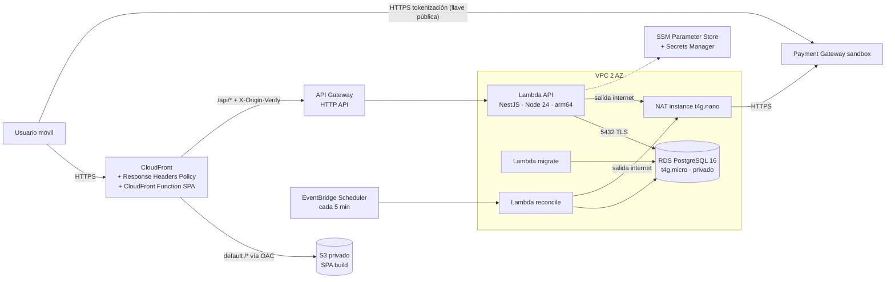

# Spec Cloud — Infraestructura AWS, CI/CD y seguridad

> **Versión 1.2** — incorpora las correcciones de la revisión y los ajustes de alcance S-01, S-03 y S-04 (ver [`CHANGELOG.md`](./CHANGELOG.md); los IDs `C-xx`/`I-xx`/`M-xx` remiten a ese registro).

> **Regla de nombres:** el repositorio es público y **no puede contener el nombre de la compañía evaluadora**. Recursos, stacks, variables y workflows usan nombres neutros (`checkout-*`, `PG_*`). La URL/host de la pasarela y sus llaves llegan desde GitHub Secrets/Variables y SSM, nunca desde el código.

---

## 0. Objetivo

Publicar la SPA y la API en AWS, conectadas y funcionando por **HTTPS**, con **infraestructura como código**, despliegue automatizado, headers de seguridad (bonus OWASP) y costo cercano a cero para el periodo de evaluación.

Entregable de la prueba: **link de la app desplegada en AWS conectada al backend** + README con la URL pública de Swagger.

---

## 1. Arquitectura



Decisiones (ADR-004):

| Decisión | Motivo |
|---|---|
| **Mismo origen**: CloudFront sirve `/*` (S3) y `/api/*` (API Gateway) | Sin CORS, una sola política de headers, un único link entregable |
| **Lambda + API Gateway HTTP API** | Sin costo fijo, HTTPS gestionado, escala a cero |
| **RDS PostgreSQL privado** (subnets aisladas) | Nunca expuesto a internet |
| **NAT instance t4g.nano** (`NatProvider.instanceV2`) en lugar de NAT Gateway | La Lambda en VPC necesita salida a la pasarela; NAT Gateway cuesta ~USD 32/mes, la instancia ~USD 3/mes |
| **CloudFront Function** para el fallback SPA (no `customErrorResponses`) | Los error responses aplican a toda la distribución y convertirían los 404/403 de la API en `index.html` |
| **Header secreto `X-Origin-Verify`** CloudFront → API | Evita que se salte CloudFront (y sus headers/rate limits) llamando directo a `execute-api` |
| **Throttling de API Gateway** (25 rps / burst 50) + pool `max: 2`; reserved concurrency **opcional** por stage (C-02) | Protege las conexiones de una RDS micro sin pagar RDS Proxy. No se reserva concurrencia por defecto: en cuentas nuevas la cuota es 10 y AWS exige dejar ≥ 10 sin reservar, así que `reservedConcurrentExecutions: 10` hace fallar el deploy |
| **Build de Lambda: `nest build` (tsc) → esbuild sobre JS** y `lambda.Function` + `Code.fromAsset` (C-01, ADR-005) | esbuild (y por tanto `NodejsFunction`) no emite `emitDecoratorMetadata`, del que depende la DI de NestJS |
| **EventBridge Scheduler → Lambda `reconcile`** cada 5 min (C-03, ADR-007) | Finaliza las transacciones PENDING aunque el cliente abandone la página y el webhook no esté registrado |
| **AWS CDK v2 en TypeScript** | Mismo lenguaje que app y API; stacks testeables con Jest; `cdk-nag` para reglas de seguridad |

Región: `us-east-1`.

---

## 2. Stack y herramientas

| Tema | Elección |
|---|---|
| IaC | AWS CDK v2 (TypeScript) en `infra/` |
| Reglas de seguridad IaC | `cdk-nag` (`AwsSolutionsChecks`) con supresiones justificadas por escrito |
| Tests IaC | Jest + `aws-cdk-lib/assertions` (`Template.fromStack`) |
| Bundling Lambda | `apps/api` genera `dist-lambda/` (tsc + esbuild, ver spec-backend BE-12); CDK usa `lambda.Function` con `Code.fromAsset`, `Runtime.NODEJS_24_X`, `Architecture.ARM_64` (C-01, I-08) |
| Tareas programadas | EventBridge Scheduler (`aws-cdk-lib/aws-scheduler` + `aws-scheduler-targets`) |
| CI/CD | GitHub Actions + **OIDC** hacia AWS (sin access keys de larga duración) |
| Logs | CloudWatch Logs (Lambdas, access logs de API Gateway, VPC Flow Logs) con retención corta |
| Verificación | Mozilla Observatory, SSL Labs, Lighthouse (manual) |

---

## 3. Estructura

```
infra/
├── bin/app.ts                       # instancia stacks por stage (context: stage=prod)
├── bin/bootstrap-oidc.ts            # app separada: GithubOidcStack, se despliega una vez a mano (I-17)
├── lib/
│   ├── config/stage-config.ts       # nombres, tamaños, límites, dominios, reserved concurrency opcional por stage
│   ├── github-oidc-stack.ts
│   ├── network-stack.ts
│   ├── database-stack.ts
│   ├── api-stack.ts
│   ├── web-stack.ts
│   └── constructs/                  # security-headers-policy.ts, spa-rewrite-function.ts, api-lambda.ts
├── functions/spa-rewrite.js         # CloudFront Function
├── scripts/put-parameters.sh        # carga secretos a SSM desde variables locales (no versionadas)
├── test/*.test.ts
└── cdk.json
.github/
├── workflows/ci.yml
├── workflows/deploy.yml
└── pull_request_template.md
```

Todos los recursos llevan tags `project=checkout`, `stage`, `managed-by=cdk`.

---

## 4. Features incrementales

Cada feature = **rama `feat/cl-XX-...` desde `main` + PR hacia `main`**. DoD común: `cdk synth` sin errores ni hallazgos de `cdk-nag` sin justificar, tests de infraestructura en verde, sin secretos en el código, README/ADR actualizado.

> **Walking skeleton:** desplegar CL-01…CL-05 apenas existan BE-03 y FE-04 (catálogo funcionando). Así el pipeline y la URL pública se prueban desde temprano y los riesgos de infraestructura salen antes del flujo de pagos.

### CL-00 · Scaffolding CDK y convenciones

- `cdk init app --language typescript` en `infra/`, TS strict, ESLint/Prettier compartidos.
- `stage-config.ts` tipado (sin valores mágicos dispersos).
- `Aspects.of(app).add(new AwsSolutionsChecks({ verbose: true }))`.
- Tags globales; `RemovalPolicy` explícita por recurso.
- `cdk bootstrap` documentado en README (paso manual único).
- Supresiones de `cdk-nag` esperadas, cada una con justificación escrita junto al recurso: `IAM4` (políticas administradas de ejecución de Lambda), `IAM5` (comodín acotado a `parameter/checkout/{stage}/*`), `L1` (runtime fijado a propósito), `APIG4` (API pública de checkout sin usuarios; se protege con origen verificado), `CFR1` (sin geo-restricción), `CFR2` (WAF opcional por costo), `CFR4` (el certificado por defecto de CloudFront no permite fijar TLS mínimo), `RDS3` (single-AZ por costo), `RDS10` (deletion protection desactivada para poder destruir tras la evaluación), `RDS11` (puerto por defecto; la DB no es pública), `SMG4` (sin rotación automática en la prueba), `EC28`/`EC29` (NAT instance sin detailed monitoring ni termination protection), `VPC7` (solo si se omiten los Flow Logs).

**Aceptación:** `npm run synth` y `npm test` en `infra/` pasan en CI.

### CL-01 · Red

- VPC con 2 AZ: subnets `PUBLIC` (NAT), `PRIVATE_WITH_EGRESS` (Lambdas), `PRIVATE_ISOLATED` (RDS).
- `natGateways: 1` con `NatProvider.instanceV2({ instanceType: t4g.nano })`.
- Security groups: `LambdaSg` (sin inbound) y `DbSg` (inbound 5432 **solo** desde `LambdaSg`).
- VPC Flow Logs a CloudWatch con retención corta (7 días) — o supresión justificada por costo.

**Aceptación:** test de assertions: RDS SG solo admite 5432 desde el SG de Lambda; no hay reglas `0.0.0.0/0` inbound.

### CL-02 · Base de datos

- `rds.DatabaseInstance`: PostgreSQL 16, `db.t4g.micro`, 20 GB gp3, `storageEncrypted: true`, `publiclyAccessible: false`, subnets aisladas, single-AZ, backup 1 día, `removalPolicy: SNAPSHOT`.
- `credentials: Credentials.fromGeneratedSecret('app_admin')` (Secrets Manager).
- Parameter group con `rds.force_ssl = 1`; la API conecta con `ssl: { rejectUnauthorized: true, ca: <bundle RDS> }` (el bundle global de RDS vive en `apps/api/certs/` y se copia a `dist-lambda/`).
- Performance Insights desactivado (costo) con supresión justificada.

**Aceptación:** assertions verifican cifrado, no pública, `force_ssl`.

### CL-03 · Secretos y configuración

- SSM Parameter Store (`SecureString`, gratis): `/checkout/{stage}/pg/base-url`, `public-key`, `private-key`, `integrity-secret`, `events-secret`.
- **Secreto de origen (C-06):** CDK crea un `secretsmanager.Secret` con valor generado (`generateSecretString`, 32 caracteres sin puntuación). CloudFront lo usa como valor del custom header `X-Origin-Verify` mediante *dynamic reference* (no queda en texto plano en la plantilla) y la Lambda lo lee al iniciar. No existe en GitHub Secrets ni en SSM. Rotarlo = nuevo valor + `cdk deploy`.
- `scripts/put-parameters.sh` lee de variables de entorno locales y ejecuta `aws ssm put-parameter --type SecureString --overwrite`; **nunca** se versionan valores. Recordatorio: `base-url` es la URL UAT de *sandbox* (I-09).
- IAM mínimo privilegio para las Lambdas: `ssm:GetParameters` sobre `arn:...:parameter/checkout/{stage}/*`, `kms:Decrypt` (clave `aws/ssm`), `secretsmanager:GetSecretValue` solo sobre el secreto de la DB y el de origen (este último solo la Lambda API).
- Config no secreta (fees, timeouts, `CORS_ALLOWED_ORIGINS`) como variables de entorno de la Lambda.

**Aceptación:** en CI, `git grep -E '(pub|prv)_(test|prod|stag[a-z]*)_[A-Za-z0-9]+|_(integrity|events)_[A-Za-z0-9]{10,}'` no encuentra coincidencias.

### CL-04 · Cómputo backend y API Gateway

- `ApiFunction` (`lambda.Function`, `Code.fromAsset('apps/api/dist-lambda')`, handler `lambda.handler`): Node 24 arm64, 1024 MB, timeout 20 s, `reservedConcurrentExecutions` **solo si `stageConfig.api.reservedConcurrency` está definido** (C-02), VPC `PRIVATE_WITH_EGRESS`, `LambdaSg`, log retention 14 días, `NODE_OPTIONS=--enable-source-maps`, `APP_ENV=aws`.
- `MigrateFunction` (mismo asset, handler `migrate.handler`): timeout 5 min, mismos permisos de DB; se invoca solo desde CD.
- `ReconcileFunction` (mismo asset, handler `reconcile.handler`, C-03): timeout 60 s, permisos de DB y SSM; la invoca un **EventBridge Scheduler** `rate(5 minutes)` sin reintentos (la corrida siguiente cubre lo pendiente), edad máxima del evento de 4 min y *flexible time window* apagado (ADR-007).
- API Gateway **HTTP API** (`$default` stage), ruta `ANY /{proxy+}` → integración Lambda (payload v2), throttling (rate 25 rps, burst 50), access logs JSON en CloudWatch.
- La API valida `X-Origin-Verify` (middleware Nest; 403 si falta o no coincide, excepto en local).

**Aceptación:** assertions de runtime (`nodejs24.x`)/arquitectura (`arm64`)/handlers; sin `ReservedConcurrentExecutions` cuando el stage no lo define; existe un `AWS::Scheduler::Schedule` con `rate(5 minutes)` apuntando a `ReconcileFunction`; smoke test post-deploy `GET https://<cf>/api/v1/health` → 200; llamada directa a `execute-api` sin el header → 403.

### CL-05 · Hosting frontend y edge (CloudFront)

- Bucket S3: `BlockPublicAccess.BLOCK_ALL`, `enforceSSL`, cifrado S3-managed, `autoDeleteObjects` solo en stages no prod.
- Distribución CloudFront:
  - **Default behavior** → S3 vía **OAC** (`S3BucketOrigin.withOriginAccessControl`), `CachePolicy.CACHING_OPTIMIZED`, `redirect-to-https`, compresión Brotli/Gzip, HTTP/2 + HTTP/3, CloudFront Function `spa-rewrite` (viewer-request: rutas sin extensión → `/index.html`).
  - **`/api/*`** → `HttpOrigin(<apiId>.execute-api.us-east-1.amazonaws.com)` con custom header `X-Origin-Verify` (valor desde el secreto de C-06), `CACHING_DISABLED`, política de *origin request* propia con allowlist (`Accept`, `Content-Type`, `Origin`, `Idempotency-Key`, `X-Request-Id`, `X-Event-Checksum` y `CloudFront-Viewer-Address`, que la API usa para el throttling por IP — I-01), todos los query strings, sin cookies ni `Host` (I-21; se verifica con un test de assertions), métodos `ALL`.
  - `defaultRootObject: index.html`, `priceClass: PRICE_CLASS_100`, access logs opcionales.
- **Response Headers Policy (web):**
  - `Strict-Transport-Security: max-age=63072000; includeSubDomains` (sin `preload`: no aplica sobre `*.cloudfront.net`; se añade solo con dominio propio — I-12)
  - `Content-Security-Policy: default-src 'self'; script-src 'self'; style-src 'self'; img-src 'self' data:; font-src 'self'; connect-src 'self' https://<PG_HOST>; frame-ancestors 'none'; base-uri 'self'; form-action 'self'; object-src 'none'; upgrade-insecure-requests` (`<PG_HOST>` viene de una variable de GitHub, no del código)
  - `X-Content-Type-Options: nosniff`, `X-Frame-Options: DENY`, `Referrer-Policy: strict-origin-when-cross-origin`
  - Custom: `Permissions-Policy: camera=(), microphone=(), geolocation=(), payment=()`, `Cross-Origin-Opener-Policy: same-origin`
- **Response Headers Policy (API):** HSTS, nosniff, `Cache-Control: no-store` (Swagger en `/api/docs*` con un behavior y CSP propios que permitan sus assets de mismo origen).
- Cache: assets con hash → `Cache-Control: public, max-age=31536000, immutable`; `index.html` → `no-cache`.
- Opcional: dominio propio + ACM para fijar TLS mínimo `TLSv1.2_2021` (el certificado por defecto de `*.cloudfront.net` no permite fijarlo).

**Aceptación:** refresh en `/transactions/<id>` devuelve la SPA; `GET /api/v1/products/<uuid-inexistente>` sigue devolviendo **404 JSON** (no `index.html`); Mozilla Observatory ≥ A.

### CL-06 · CI (pull requests)

`ci.yml` en cada PR, en cada push a `main` y a mano (`workflow_dispatch`):

1. `npm ci` con caché; jobs en paralelo `api`, `web`, `infra`.
2. **api:** lint → typecheck → `dependency-cruiser` → `jest --coverage` (umbral 85 %; Testcontainers usa el Docker del runner) → `build:lambda` (tsc + esbuild) → smoke `node -e "require('./dist-lambda/lambda.js')"`.
3. **web:** lint → stylelint → typecheck → `jest --coverage` → build.
4. **infra:** `cdk synth` (con `cdk-nag`; necesita el artefacto `dist-lambda/` del job api o un placeholder) → tests de assertions.
5. **Guardas:** búsqueda de patrones de llaves de la pasarela; `npm audit --omit=dev --audit-level=high`.
6. Publicar reportes de cobertura como artefactos.

Branch protection en `main`: PR obligatorio + checks en verde.

### CL-07 · CD (despliegue continuo)

`deploy.yml` en push a `main` (y `workflow_dispatch`). Mientras la variable de repositorio `AWS_DEPLOY_ROLE_ARN` no exista, el job se omite en vez de fallar. El job no declara `environment:`, para que el `sub` del token OIDC sea `ref:refs/heads/main` (I-22):

0. **Prerrequisito manual único (I-17):** `cdk bootstrap` y `cdk deploy -a "npx ts-node bin/bootstrap-oidc.ts"` → `GithubOidcStack` crea el OIDC provider de GitHub y el rol de despliegue. Trust policy: `token.actions.githubusercontent.com:aud = sts.amazonaws.com` y `sub = repo:<owner>/<repo>:ref:refs/heads/main`. Permisos: solo `sts:AssumeRole` sobre `arn:aws:iam::<account>:role/cdk-*` (los roles de bootstrap hacen el resto), más `s3:*` sobre el bucket web, `cloudfront:CreateInvalidation` y `lambda:InvokeFunction` sobre `MigrateFunction`.
1. `aws-actions/configure-aws-credentials` con **OIDC** asumiendo ese rol.
2. `npm ci` → `npm run build:lambda -w apps/api` → `cdk deploy --all --require-approval never --outputs-file outputs.json` (context: `pgHost` desde GitHub Variables; el secreto de origen ya no se pasa, lo genera CDK — C-06).
3. `aws lambda invoke` de `MigrateFunction` → falla el job si `FunctionError` está presente (migraciones + seed idempotente). Como el código nuevo ya está publicado en este punto, las migraciones deben ser **expand/contract** (I-16).
4. Build web con `VITE_API_BASE_URL=/api`, `VITE_PG_BASE_URL`, `VITE_PG_PUBLIC_KEY` (GitHub Variables).
5. `aws s3 sync dist/ s3://<bucket> --delete` con cache-control diferenciado (assets immutable / `index.html` no-cache).
6. `aws cloudfront create-invalidation --paths /index.html`.
7. **Smoke tests:** `/` 200, `/api/v1/health` 200, `/api/v1/products` con ≥ 1 producto, headers de seguridad presentes (`curl -I` + asserts).

Los outputs de CDK (URL de CloudFront, bucket, id de distribución, nombre de la Lambda de migración) se exportan con `--outputs-file` y se leen en los pasos siguientes.

### CL-09 · Verificación de seguridad y documentación de despliegue

- Correr Mozilla Observatory, SSL Labs y securityheaders.com sobre la URL de CloudFront; guardar capturas en `docs/security/`.
- Checklist OWASP de infraestructura en `docs/security/README.md` (M-02): TLS en todos los saltos (cliente→CF, CF→API GW, Lambda→RDS con `force_ssl`, Lambda→pasarela), DB privada, mínimo privilegio IAM, sin llaves estáticas en CI, secretos en SSM, logs sin PII.
- Sección README "Despliegue": diagrama, URLs (app, Swagger), cómo desplegar desde cero (bootstrap → put-parameters → push a main), cómo destruir, costos.

Costo estimado del periodo de evaluación (aprox., depende de si la cuenta tiene free tier clásico o créditos del plan gratuito):

| Recurso | Aprox. mensual |
|---|---|
| RDS db.t4g.micro + 20 GB | ~USD 12–15 (cubierto por free tier/créditos si aplica) |
| NAT instance t4g.nano | ~USD 3 |
| Secrets Manager (2 secretos: DB y origen) | ~USD 0.80 |
| Lambda, API Gateway, CloudFront, S3, SSM, EventBridge Scheduler | ~USD 0 al volumen de la prueba |

Tras la evaluación: `cdk destroy --all` (documentado).

**Aceptación:** los tres links (app, Swagger, repo) funcionan desde un móvil real; flujo de pago aprobado y rechazado completado en producción con las tarjetas de prueba de la sandbox.
