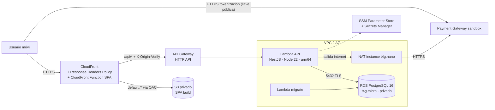

# Spec Cloud — Infraestructura AWS, CI/CD y seguridad

> **Regla de nombres:** el repositorio es público y **no puede contener el nombre de la compañía evaluadora**. Recursos, stacks, variables y workflows usan nombres neutros (`checkout-*`, `PG_*`). La URL/host de la pasarela y sus llaves llegan desde GitHub Secrets/Variables y SSM, nunca desde el código.

---

## 0. Objetivo

Publicar la SPA y la API en AWS, conectadas y funcionando por **HTTPS**, con **infraestructura como código**, despliegue automatizado, headers de seguridad (bonus OWASP) y costo cercano a cero para el periodo de evaluación.

Entregable de la prueba: **link de la app desplegada en AWS conectada al backend** + README con la URL pública de Swagger.

---

## 1. Arquitectura



Decisiones (ADR-004):

| Decisión | Motivo |
|---|---|
| **Mismo origen**: CloudFront sirve `/*` (S3) y `/api/*` (API Gateway) | Sin CORS, una sola política de headers, un único link entregable |
| **Lambda + API Gateway HTTP API** | Sin costo fijo, HTTPS gestionado, escala a cero |
| **RDS PostgreSQL privado** (subnets aisladas) | Nunca expuesto a internet |
| **NAT instance t4g.nano** (`NatProvider.instanceV2`) en lugar de NAT Gateway | La Lambda en VPC necesita salida a la pasarela; NAT Gateway cuesta ~USD 32/mes, la instancia ~USD 3/mes |
| **CloudFront Function** para el fallback SPA (no `customErrorResponses`) | Los error responses aplican a toda la distribución y convertirían los 404/403 de la API en `index.html` |
| **Header secreto `X-Origin-Verify`** CloudFront → API | Evita que se salte CloudFront (y sus headers/rate limits) llamando directo a `execute-api` |
| **Reserved concurrency** en la Lambda API (10) + pool `max: 2` | Protege las conexiones de una RDS micro sin pagar RDS Proxy |
| **AWS CDK v2 en TypeScript** | Mismo lenguaje que app y API; stacks testeables con Jest; `cdk-nag` para reglas de seguridad |

Región: `us-east-1`.

---

## 2. Stack y herramientas

| Tema | Elección |
|---|---|
| IaC | AWS CDK v2 (TypeScript) en `infra/` |
| Reglas de seguridad IaC | `cdk-nag` (`AwsSolutionsChecks`) con supresiones justificadas por escrito |
| Tests IaC | Jest + `aws-cdk-lib/assertions` (`Template.fromStack`) |
| Bundling Lambda | `NodejsFunction` (esbuild), `Runtime.NODEJS_22_X`, `Architecture.ARM_64` |
| CI/CD | GitHub Actions + **OIDC** hacia AWS (sin access keys de larga duración) |
| Monitoreo | CloudWatch Logs/Alarms + SNS (email) + AWS Budgets |
| Verificación | Mozilla Observatory, SSL Labs, Lighthouse CI |

---

## 3. Estructura

```
infra/
├── bin/app.ts                       # instancia stacks por stage (context: stage=prod)
├── lib/
│   ├── config/stage-config.ts       # nombres, tamaños, límites, dominios por stage
│   ├── network-stack.ts
│   ├── database-stack.ts
│   ├── api-stack.ts
│   ├── web-stack.ts
│   ├── monitoring-stack.ts
│   └── constructs/                  # security-headers-policy.ts, spa-rewrite-function.ts, api-lambda.ts
├── functions/spa-rewrite.js         # CloudFront Function
├── scripts/put-parameters.sh        # carga secretos a SSM desde variables locales (no versionadas)
├── test/*.test.ts
└── cdk.json
.github/
├── workflows/ci.yml
├── workflows/deploy.yml
├── dependabot.yml
└── pull_request_template.md
```

Todos los recursos llevan tags `project=checkout`, `stage`, `managed-by=cdk`.

---

## 4. Features incrementales

Cada feature = **rama `feat/cl-XX-...` + PR**. DoD común: `cdk synth` sin errores ni hallazgos de `cdk-nag` sin justificar, tests de infraestructura en verde, sin secretos en el código, README/ADR actualizado.

> **Walking skeleton:** desplegar CL-01…CL-05 apenas existan BE-03 y FE-04 (catálogo funcionando). Así el pipeline y la URL pública se prueban desde temprano y los riesgos de infraestructura salen antes del flujo de pagos.

### CL-00 · Scaffolding CDK y convenciones

- `cdk init app --language typescript` en `infra/`, TS strict, ESLint/Prettier compartidos.
- `stage-config.ts` tipado (sin valores mágicos dispersos).
- `Aspects.of(app).add(new AwsSolutionsChecks({ verbose: true }))`.
- Tags globales; `RemovalPolicy` explícita por recurso.
- `cdk bootstrap` documentado en README (paso manual único).

**Aceptación:** `npm run synth` y `npm test` en `infra/` pasan en CI.

### CL-01 · Red

- VPC con 2 AZ: subnets `PUBLIC` (NAT), `PRIVATE_WITH_EGRESS` (Lambdas), `PRIVATE_ISOLATED` (RDS).
- `natGateways: 1` con `NatProvider.instanceV2({ instanceType: t4g.nano })`.
- Security groups: `LambdaSg` (sin inbound) y `DbSg` (inbound 5432 **solo** desde `LambdaSg`).
- VPC Flow Logs a CloudWatch con retención corta (7 días) — o supresión justificada por costo.

**Aceptación:** test de assertions: RDS SG solo admite 5432 desde el SG de Lambda; no hay reglas `0.0.0.0/0` inbound.

### CL-02 · Base de datos

- `rds.DatabaseInstance`: PostgreSQL 16, `db.t4g.micro`, 20 GB gp3, `storageEncrypted: true`, `publiclyAccessible: false`, subnets aisladas, single-AZ, backup 1 día, `removalPolicy: SNAPSHOT`.
- `credentials: Credentials.fromGeneratedSecret('app_admin')` (Secrets Manager).
- Parameter group con `rds.force_ssl = 1`; la API conecta con `ssl: { rejectUnauthorized: true, ca: <bundle RDS> }` (el bundle global de RDS se empaqueta con la Lambda).
- Performance Insights desactivado (costo) con supresión justificada.

**Aceptación:** assertions verifican cifrado, no pública, `force_ssl`.

### CL-03 · Secretos y configuración

- SSM Parameter Store (`SecureString`, gratis): `/checkout/{stage}/pg/base-url`, `public-key`, `private-key`, `integrity-secret`, `events-secret`, `/checkout/{stage}/origin-verify-secret`.
- `scripts/put-parameters.sh` lee de variables de entorno locales y ejecuta `aws ssm put-parameter --type SecureString --overwrite`; **nunca** se versionan valores.
- IAM mínimo privilegio para la Lambda: `ssm:GetParameters` sobre `arn:...:parameter/checkout/{stage}/*`, `kms:Decrypt` (clave `aws/ssm`), `secretsmanager:GetSecretValue` solo sobre el secreto de la DB.
- Config no secreta (fees, timeouts, `CORS_ALLOWED_ORIGINS`) como variables de entorno de la Lambda.

**Aceptación:** en CI, `git grep -E '(pub|prv)_(test|prod|stag[a-z]*)_[A-Za-z0-9]+|_(integrity|events)_[A-Za-z0-9]{10,}'` no encuentra coincidencias.

### CL-04 · Cómputo backend y API Gateway

- `ApiFunction` (`NodejsFunction` → `apps/api/src/lambda.ts`): 1024 MB, timeout 20 s, `reservedConcurrentExecutions: 10`, VPC `PRIVATE_WITH_EGRESS`, `LambdaSg`, log retention 14 días, `NODE_OPTIONS=--enable-source-maps`.
- `MigrateFunction` (`apps/api/src/migrate.ts`): timeout 5 min, mismos permisos de DB; se invoca solo desde CD.
- API Gateway **HTTP API** (`$default` stage), ruta `ANY /{proxy+}` → integración Lambda (payload v2), throttling (rate 25 rps, burst 50), access logs JSON en CloudWatch.
- La API valida `X-Origin-Verify` (middleware Nest; 403 si falta o no coincide, excepto en local).

**Aceptación:** assertions de runtime/arquitectura/concurrencia; smoke test post-deploy `GET https://<cf>/api/v1/health` → 200; llamada directa a `execute-api` sin el header → 403.

### CL-05 · Hosting frontend y edge (CloudFront)

- Bucket S3: `BlockPublicAccess.BLOCK_ALL`, `enforceSSL`, cifrado S3-managed, `autoDeleteObjects` solo en stages no prod.
- Distribución CloudFront:
  - **Default behavior** → S3 vía **OAC** (`S3BucketOrigin.withOriginAccessControl`), `CachePolicy.CACHING_OPTIMIZED`, `redirect-to-https`, compresión Brotli/Gzip, HTTP/2 + HTTP/3, CloudFront Function `spa-rewrite` (viewer-request: rutas sin extensión → `/index.html`).
  - **`/api/*`** → `HttpOrigin(<apiId>.execute-api.us-east-1.amazonaws.com)` con custom header `X-Origin-Verify`, `CACHING_DISABLED`, `ALL_VIEWER_EXCEPT_HOST_HEADER`, métodos `ALL`.
  - `defaultRootObject: index.html`, `priceClass: PRICE_CLASS_100`, access logs opcionales.
- **Response Headers Policy (web):**
  - `Strict-Transport-Security: max-age=63072000; includeSubDomains; preload`
  - `Content-Security-Policy: default-src 'self'; script-src 'self'; style-src 'self'; img-src 'self' data:; font-src 'self'; connect-src 'self' https://<PG_HOST>; frame-ancestors 'none'; base-uri 'self'; form-action 'self'; object-src 'none'; upgrade-insecure-requests` (`<PG_HOST>` viene de una variable de GitHub, no del código)
  - `X-Content-Type-Options: nosniff`, `X-Frame-Options: DENY`, `Referrer-Policy: strict-origin-when-cross-origin`
  - Custom: `Permissions-Policy: camera=(), microphone=(), geolocation=(), payment=()`, `Cross-Origin-Opener-Policy: same-origin`
- **Response Headers Policy (API):** HSTS, nosniff, `Cache-Control: no-store` (Swagger en `/api/docs*` con un behavior y CSP propios que permitan sus assets de mismo origen).
- Cache: assets con hash → `Cache-Control: public, max-age=31536000, immutable`; `index.html` → `no-cache`.
- Opcional: dominio propio + ACM para fijar TLS mínimo `TLSv1.2_2021` (el certificado por defecto de `*.cloudfront.net` no permite fijarlo).

**Aceptación:** refresh en `/transactions/<id>` devuelve la SPA; `GET /api/v1/products/<uuid-inexistente>` sigue devolviendo **404 JSON** (no `index.html`); Mozilla Observatory ≥ A.

### CL-06 · CI (pull requests)

`ci.yml` en cada PR y push:

1. `npm ci` con caché; jobs en paralelo `api`, `web`, `infra`.
2. **api:** lint → typecheck → `dependency-cruiser` → `jest --coverage` (umbral 85 %; Testcontainers usa el Docker del runner) → build.
3. **web:** lint → stylelint → typecheck → `jest --coverage` → build → **Lighthouse CI** sobre `dist` (móvil, budgets de FE-10).
4. **infra:** `cdk synth` (con `cdk-nag`) → tests de assertions.
5. **Guardas:** búsqueda de palabras prohibidas usando el secreto `FORBIDDEN_WORDS` (así la palabra no queda escrita en el repo) y de patrones de llaves; `npm audit --omit=dev --audit-level=high`.
6. Publicar reportes de cobertura como artefactos.

Branch protection en `main`: PR obligatorio + checks en verde. `dependabot.yml` semanal para npm y GitHub Actions.

### CL-07 · CD (despliegue continuo)

`deploy.yml` en push a `main` (y `workflow_dispatch`):

1. `aws-actions/configure-aws-credentials` con **OIDC**: rol IAM cuya trust policy restringe `token.actions.githubusercontent.com:sub` a `repo:<owner>/<repo>:ref:refs/heads/main`.
2. `cdk deploy --all --require-approval never` (context: `pgHost`, `originVerifySecret` desde GitHub Secrets).
3. `aws lambda invoke` de `MigrateFunction` → falla el job si `FunctionError` está presente (migraciones + seed idempotente).
4. Build web con `VITE_API_BASE_URL=/api`, `VITE_PG_BASE_URL`, `VITE_PG_PUBLIC_KEY` (GitHub Variables).
5. `aws s3 sync dist/ s3://<bucket> --delete` con cache-control diferenciado (assets immutable / `index.html` no-cache).
6. `aws cloudfront create-invalidation --paths /index.html`.
7. **Smoke tests:** `/` 200, `/api/v1/health` 200, `/api/v1/products` con ≥ 1 producto, headers de seguridad presentes (`curl -I` + asserts).

Los outputs de CDK (URL de CloudFront, bucket, id de distribución, nombre de la Lambda de migración) se exportan con `--outputs-file` y se leen en los pasos siguientes.

### CL-08 · Observabilidad y control de costos

- Alarmas CloudWatch → SNS (email): errores de Lambda API > 0 en 5 min, throttles > 0, API Gateway 5xx > 1 %, duración p95 > 5 s, RDS CPU > 80 %, `FreeStorageSpace` < 2 GB, NAT instance `StatusCheckFailed`.
- Retención de logs 14 días.
- **AWS Budgets**: alerta al 50/80/100 % de USD 10/mes.
- Dashboard CloudWatch mínimo (invocaciones, errores, latencia, conexiones DB).

Costo estimado del periodo de evaluación (aprox., depende de si la cuenta tiene free tier clásico o créditos del plan gratuito):

| Recurso | Aprox. mensual |
|---|---|
| RDS db.t4g.micro + 20 GB | ~USD 12–15 (cubierto por free tier/créditos si aplica) |
| NAT instance t4g.nano | ~USD 3 |
| Secrets Manager (1 secreto) | ~USD 0.40 |
| Lambda, API Gateway, CloudFront, S3, SSM | ~USD 0 al volumen de la prueba |

Tras la evaluación: `cdk destroy --all` (documentado).

### CL-09 · Verificación de seguridad y documentación de despliegue

- Correr Mozilla Observatory, SSL Labs y securityheaders.com sobre la URL de CloudFront; guardar capturas en `docs/security/`.
- Checklist OWASP de infraestructura en `docs/security.md`: TLS en todos los saltos (cliente→CF, CF→API GW, Lambda→RDS con `force_ssl`, Lambda→pasarela), DB privada, mínimo privilegio IAM, sin llaves estáticas en CI, secretos en SSM, logs sin PII.
- Sección README "Despliegue": diagrama, URLs (app, Swagger), cómo desplegar desde cero (bootstrap → put-parameters → push a main), cómo destruir, costos.

**Aceptación:** los tres links (app, Swagger, repo) funcionan desde un móvil real; flujo de pago aprobado y rechazado completado en producción con las tarjetas de prueba de la sandbox.
