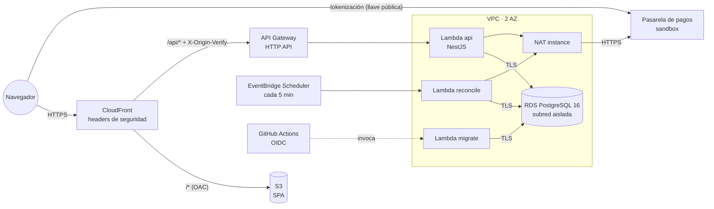

# Infraestructura (AWS CDK)

Infraestructura como código del checkout en AWS, con CDK v2 en TypeScript. Un solo dominio de CloudFront sirve la SPA y la API, así que el navegador no necesita CORS. Todo cabe en la capa gratuita salvo la NAT instance y Secrets Manager (ver [Costos](#costos)).

## Arquitectura



| Stack | Contenido |
|---|---|
| `checkout-prod-network` | VPC con subredes públicas, privadas con salida y aisladas en 2 AZ; NAT instance `t4g.nano`; security groups; *flow logs* |
| `checkout-prod-database` | RDS PostgreSQL 16 `t4g.micro` privada, cifrada y con TLS obligatorio; credenciales en Secrets Manager |
| `checkout-prod-api` | Lambdas `api`, `migrate` y `reconcile` (Node 24, arm64) desde `apps/api/dist-lambda`; HTTP API con throttling y *access logs*; schedule de reconciliación; secreto `X-Origin-Verify` |
| `checkout-prod-web` | Bucket S3 privado (OAC); CloudFront con la función de rutas de la SPA, `/api/*` sin caché y políticas de cabeceras para la SPA, la API y Swagger |
| `checkout-prod-github-oidc` | App aparte (`bin/bootstrap-oidc.ts`) que se despliega una vez a mano: el proveedor OIDC y el rol que usa el pipeline |

Las decisiones de fondo están en [ADR-004](../docs/adr/004-lambda-postgres-cloudfront.md) (Lambda + RDS + CloudFront) y [ADR-005](../docs/adr/005-lambda-build-tsc-esbuild.md) (build de la Lambda). Los controles de seguridad, en [`docs/security/README.md`](../docs/security/README.md).

## Desplegar desde cero

Requisitos: una cuenta de AWS, AWS CLI con credenciales de administrador (solo para los pasos 1 a 3), Node 24 y `jq`.

1. **Bootstrap de CDK** en `us-east-1`, una vez por cuenta:

   ```bash
   cd infra && npx cdk bootstrap aws://<account-id>/us-east-1
   ```

2. **Rol de despliegue para GitHub (OIDC).** Solo confía en la rama `main` del repositorio indicado:

   ```bash
   npx cdk deploy -a "npx tsx bin/bootstrap-oidc.ts" -c repository=<owner>/<repo>
   ```

3. **Llaves de la pasarela en SSM** (`SecureString`, bajo `/checkout/prod/`). El script las lee del entorno y las pasa por stdin, así que no quedan en el historial de la shell:

   ```bash
   export PG_BASE_URL=... PG_PUBLIC_KEY=... PG_PRIVATE_KEY=... PG_INTEGRITY_SECRET=... PG_EVENTS_SECRET=...
   STAGE=prod ./infra/scripts/put-parameters.sh
   ```

4. **Variables de GitHub** (*Settings → Secrets and variables → Actions*):

   | Nombre | Tipo | Valor |
   |---|---|---|
   | `AWS_DEPLOY_ROLE_ARN` | Variable | ARN del rol creado en el paso 2 |
   | `PG_HOST` | Variable | Host de la pasarela, para el `connect-src` de la CSP |
   | `PG_BASE_URL` | Variable | URL de la sandbox (la usa el navegador para tokenizar) |
   | `PG_PUBLIC_KEY` | Variable | Llave pública (pública por diseño) |

5. **Push a `main`.** El workflow [`deploy.yml`](../.github/workflows/deploy.yml) hace, en orden:
   1. Construye la Lambda: `tsc` y luego esbuild.
   2. Corre `cdk deploy --all`.
   3. Ejecuta las migraciones y el seed a través de la Lambda `migrate`, porque la base es privada.
   4. Construye la SPA y la publica en S3 con caché diferenciada; los assets con hash se conservan para los clientes que todavía tengan el `index.html` anterior.
   5. Invalida `index.html` y corre [`smoke-test.sh`](scripts/smoke-test.sh), que comprueba:
      - que la SPA y `health` responden;
      - que hay productos;
      - que un 404 de la API sigue siendo JSON;
      - que funcionan los *deep links*;
      - que están las cabeceras de seguridad;
      - que API Gateway rechaza las llamadas directas.

La URL de la app es el output `AppUrl` del stack web. Swagger queda en `<AppUrl>/api/docs`.

Como el código nuevo ya está publicado cuando corren las migraciones, estas deben ser *expand/contract*, es decir, compatibles con la versión anterior (I-16).

## Destruir

```bash
cd infra && npx cdk destroy --all -c pgHost=<host>
```

RDS deja un *snapshot* final y el bucket web se conserva (`RETAIN`); ambos se borran a mano. El stack de OIDC se destruye aparte, con el mismo `-a` del paso 2.

## Costos

Aproximados por mes, durante la evaluación:

| Recurso | Costo |
|---|---|
| RDS `db.t4g.micro` + 20 GB | ~USD 12–15 (cubierto por la capa gratuita o los créditos, si la cuenta los tiene) |
| NAT instance `t4g.nano` | ~USD 3 (un NAT Gateway costaría ~USD 32) |
| Secrets Manager (DB y origen) | ~USD 0.80 |
| Lambda, API Gateway, CloudFront, S3, SSM, EventBridge Scheduler | ~USD 0 al volumen de la prueba |

## Pruebas

```bash
npm test -w infra                                        # aserciones sobre las plantillas + cdk-nag
npm run synth -w infra -- -c pgHost=gateway.example      # synth completo, como en CI
```

**52 tests en 10 suites**, sin snapshots completos. Cada stack tiene un test que falla ante cualquier hallazgo de `cdk-nag` sin justificación escrita. Cobertura: 100 % de statements, funciones y líneas, y 90.47 % de branches.
